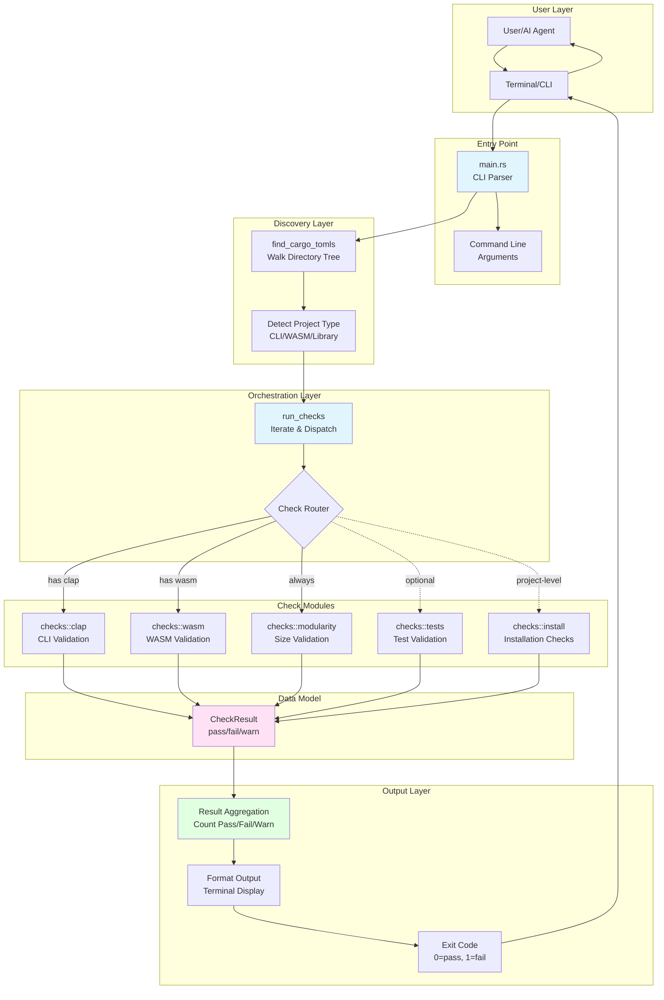
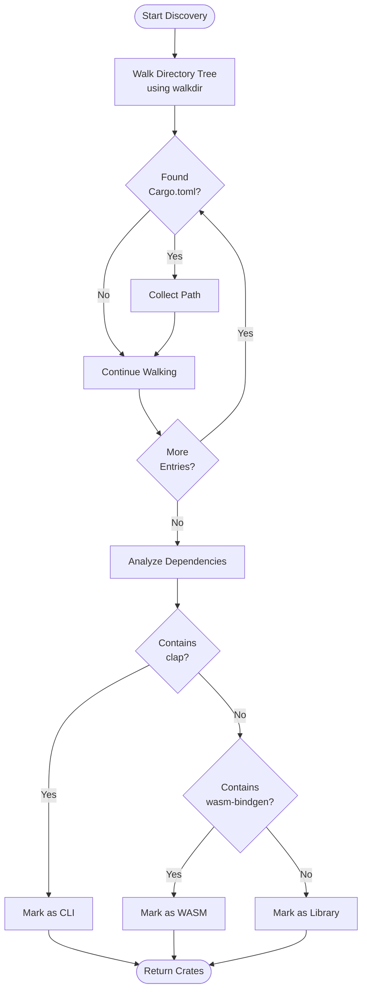
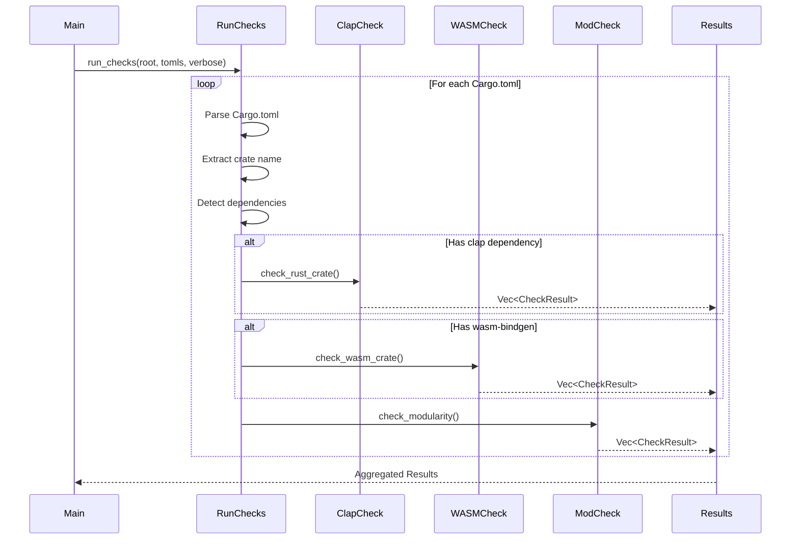
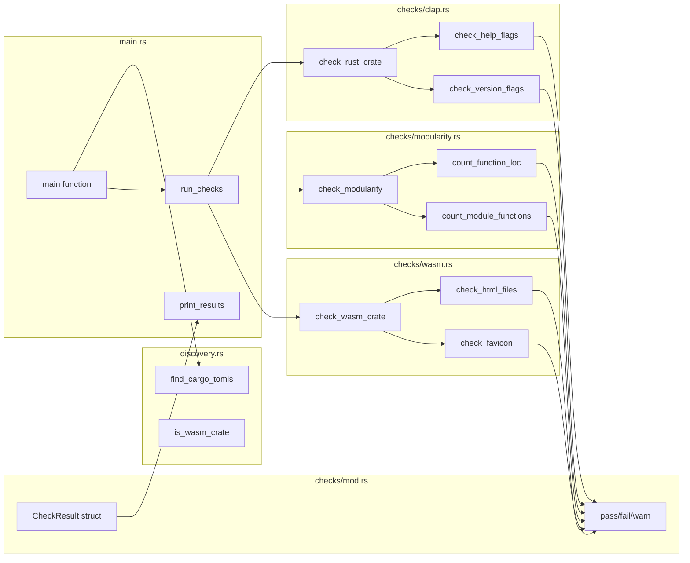
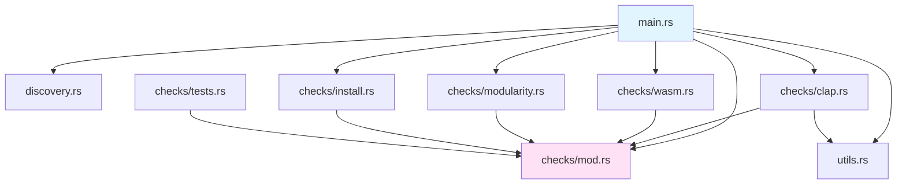
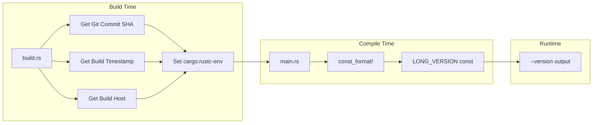
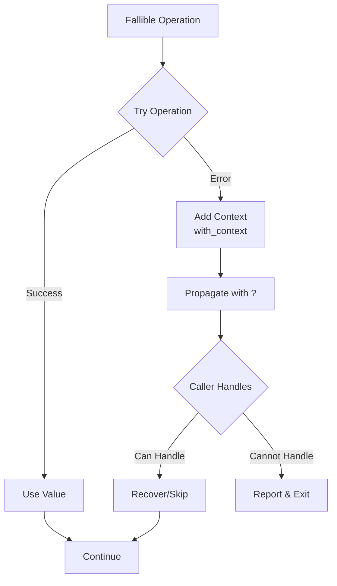

# Architecture Overview

This document provides a comprehensive overview of the sw-checklist system architecture, including component diagrams and design patterns.

## High-Level Architecture



## System Layers

### 1. Entry Point Layer

**Purpose**: Parse CLI arguments and initialize the application

**Components**:
- `main()` function in `src/main.rs`
- `Cli` struct using clap derive macros
- Build-time metadata (commit SHA, timestamp, build host)

**Responsibilities**:
- Parse command-line arguments (project path, verbose flag)
- Display version information with metadata
- Provide help text including AI agent instructions
- Canonicalize project path

### 2. Discovery Layer

**Purpose**: Find and identify all crates in the project

**Components**:
- `discovery::find_cargo_tomls()` - Find all Cargo.toml files
- `discovery::is_wasm_crate()` - Detect WASM projects
- Project type detection logic

**Algorithm**:


**Key Features**:
- Recursive directory traversal
- Workspace support (finds all member crates)
- Multi-crate project support
- Automatic type detection

### 3. Orchestration Layer

**Purpose**: Coordinate execution of appropriate checks for each crate

**Component**: `run_checks()` function in `src/main.rs`

**Flow**:


**Responsibilities**:
- Iterate over all discovered crates
- Parse each Cargo.toml file
- Determine which checks to run
- Aggregate results from all checks
- Handle errors gracefully

### 4. Check Module Layer

**Purpose**: Perform specific validation checks

**Modules**:

#### checks::clap (src/checks/clap.rs)
- Binary discovery and validation
- Help flag comparison (-h vs --help)
- Version flag comparison (-V vs --version)
- Metadata validation (copyright, license, repo, build info)
- Binary freshness checks

#### checks::wasm (src/checks/wasm.rs)
- HTML file validation
- Favicon presence and references
- Footer metadata in source code

#### checks::modularity (src/checks/modularity.rs)
- Function LOC counting
- Module function counting
- Crate module counting
- File LOC validation

#### checks::tests (src/checks/tests.rs)
- Test directory presence
- Test annotation detection
- Jest test detection (for WASM)

#### checks::install (src/checks/install.rs)
- sw-install tool presence
- Binary installation freshness

### 5. Data Model Layer

**Purpose**: Represent check results uniformly

**Structure**:
```rust
pub struct CheckResult {
    pub name: String,      // Check identifier
    pub passed: bool,      // True if check passed
    pub message: String,   // Detailed message
    pub is_warning: bool,  // True for warnings vs failures
}
```

**Factory Methods**:
```rust
CheckResult::pass(name, message)  // Passed check
CheckResult::fail(name, message)  // Failed check
CheckResult::warn(name, message)  // Warning (not a failure)
```

**Characteristics**:
- Immutable after creation
- Self-contained (includes all display info)
- Serializable (future: JSON output)
- Type-safe construction

### 6. Output Layer

**Purpose**: Present results to the user

**Components**:
- `print_results()` - Format and display results
- Summary calculation (passed, failed, warnings)
- Exit code determination

**Output Format**:
```
Checking project: /path/to/project
Project type: CLI
Found 3 Cargo.toml file(s)

Check Results:
================================================================================
✓ PASS | Clap Dependency
       Found clap dependency

⚠ WARN | Function LOC [my-crate]
       Function 'large_function' in utils.rs has 30 lines (warning at >25, max 50)

✗ FAIL | Module Function Count [my-crate]
       Module src/helpers.rs has 8 functions (max 7)

Summary: 12 passed, 1 failed, 2 warnings
```

## Component Interaction Diagram



## Design Patterns

### 1. Single Responsibility Principle
Each check module has a single domain of validation:
- `clap.rs` - Only CLI argument validation
- `wasm.rs` - Only WASM project validation
- `modularity.rs` - Only size/complexity validation

### 2. Factory Pattern
`CheckResult` uses factory methods for type-safe construction:
```rust
CheckResult::pass("Check Name", "Success message")
CheckResult::fail("Check Name", "Failure message")
CheckResult::warn("Check Name", "Warning message")
```

### 3. Strategy Pattern
Check selection is dynamic based on project type:
- Has clap → Run CLI checks
- Has WASM → Run WASM checks
- All projects → Run modularity checks

### 4. Aggregate Pattern
Results are collected and aggregated:
```rust
let mut results = Vec::new();
results.extend(check_clap(...)?);
results.extend(check_wasm(...)?);
results.extend(check_modularity(...)?);
```

## Dependency Graph



## Build System



**Build-time Constants**:
- `BUILD_COMMIT_SHA` - Git commit hash
- `BUILD_TIMESTAMP` - ISO 8601 build time
- `BUILD_HOST` - Hostname of build machine

## Error Handling Strategy



**Principles**:
- All fallible operations return `Result<T, anyhow::Error>`
- Context added at each level with `.with_context()`
- Graceful degradation where possible
- Clear error messages with file paths

## Performance Characteristics

**Time Complexity**:
- Project discovery: O(n) where n = number of files
- Check execution: O(m × l) where m = number of modules, l = lines per module
- Overall: Linear with codebase size

**Space Complexity**:
- Results storage: O(c) where c = number of checks
- File reading: O(f) where f = largest file size
- Overall: Linear with project size

**Typical Performance**:
- Small projects (1-5 crates, <5k LOC): <500ms
- Medium projects (5-10 crates, <20k LOC): <2s
- Large projects (>10 crates, >50k LOC): <5s

## Extensibility Points

### Adding New Checks

1. Create new module in `src/checks/`
2. Implement check function returning `Vec<CheckResult>`
3. Call from `run_checks()` in main.rs
4. Add tests in module

**Example**:
```rust
// src/checks/documentation.rs
use super::CheckResult;

pub fn check_documentation(crate_dir: &Path, crate_name: &str)
    -> anyhow::Result<Vec<CheckResult>>
{
    let mut results = Vec::new();

    // Perform checks...
    if has_readme {
        results.push(CheckResult::pass(
            format!("README [{}]", crate_name),
            "README.md found"
        ));
    } else {
        results.push(CheckResult::fail(
            format!("README [{}]", crate_name),
            "Missing README.md"
        ));
    }

    Ok(results)
}
```

### Adding New Project Types

1. Add detection logic in main.rs project type detection
2. Create new check module if needed
3. Add to check orchestration in `run_checks()`

## Security Considerations

**Threat Model**:
- Assumes trusted project directories
- No network access
- No arbitrary code execution
- Read-only operations (except tests)

**Mitigations**:
- No `unsafe` code
- Path canonicalization
- Safe file operations
- No shell command execution with user input

## Related Documentation

- **[System Flows](System-Flows)** - Sequence diagrams and data flows
- **[Component Details](Component-Details)** - Detailed component documentation
- **[Design Decisions](Design-Decisions)** - Architectural decision records
