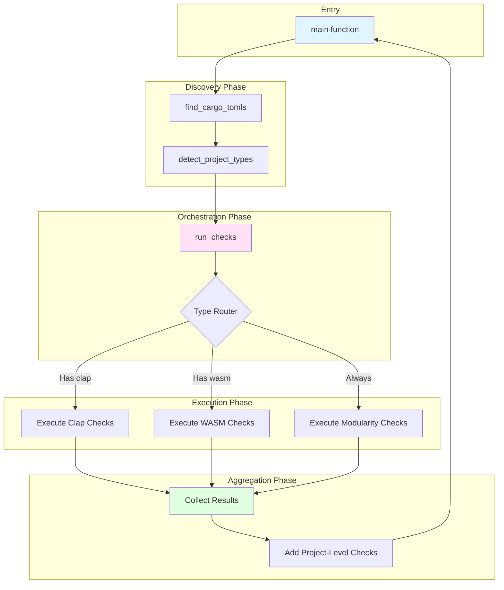
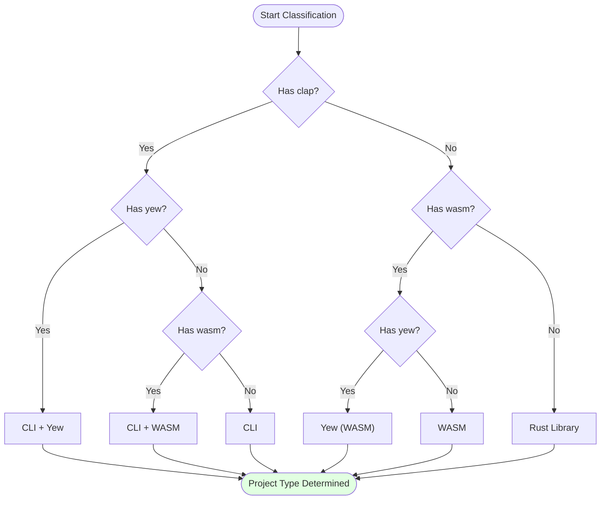
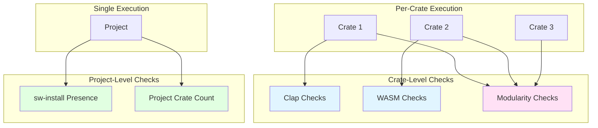
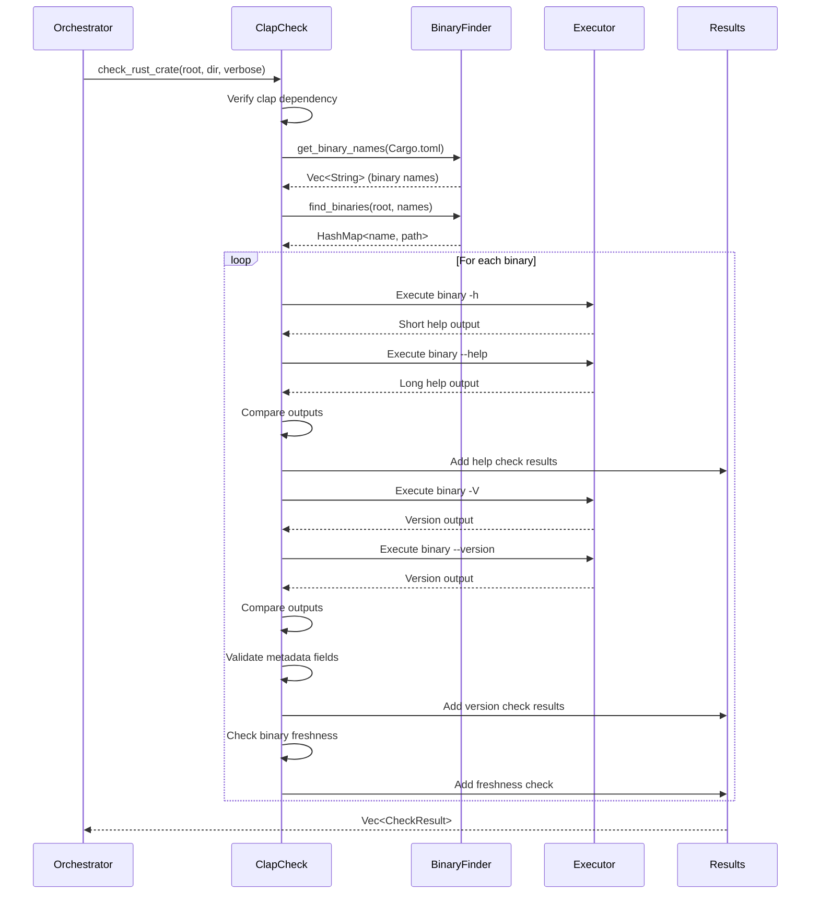
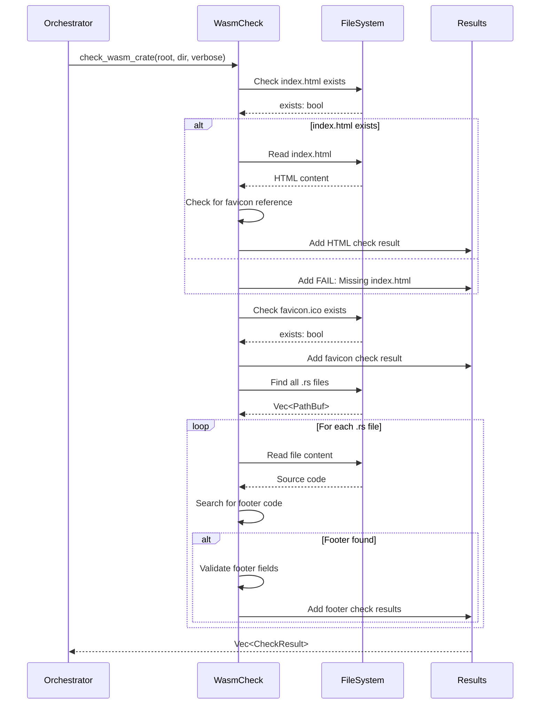
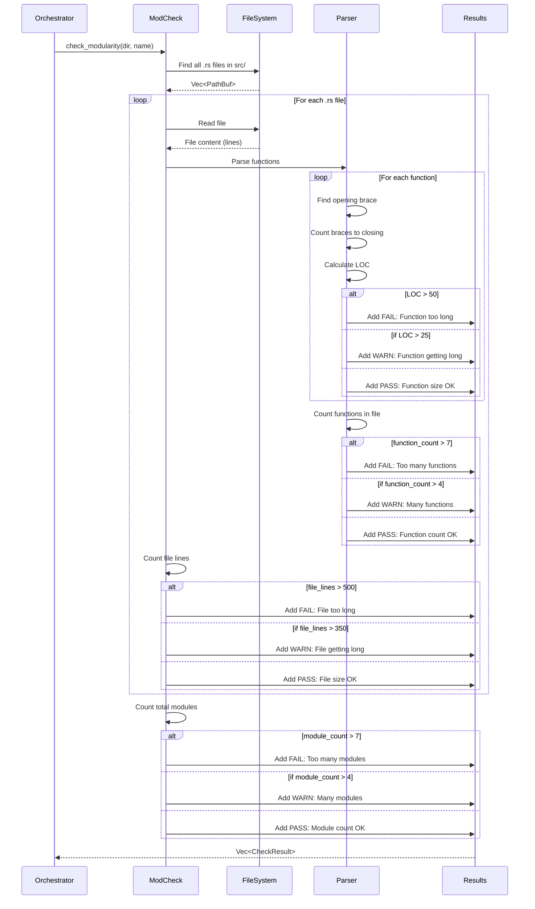
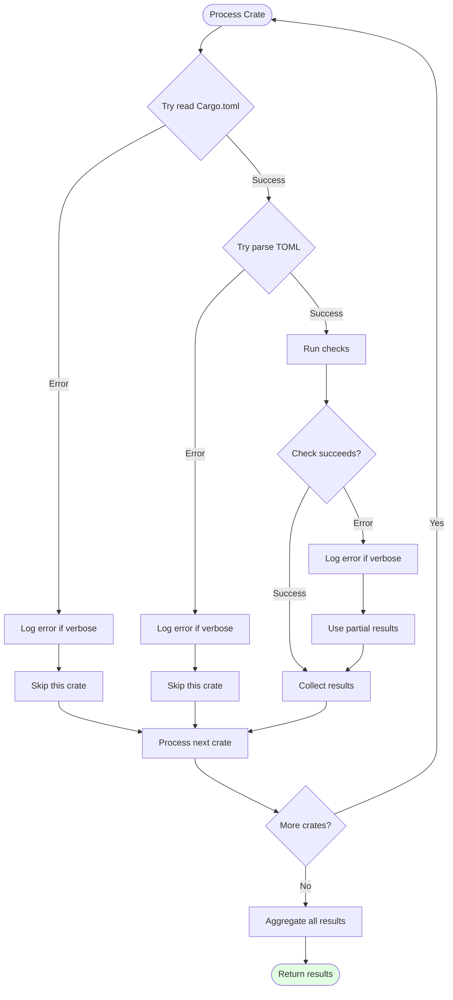
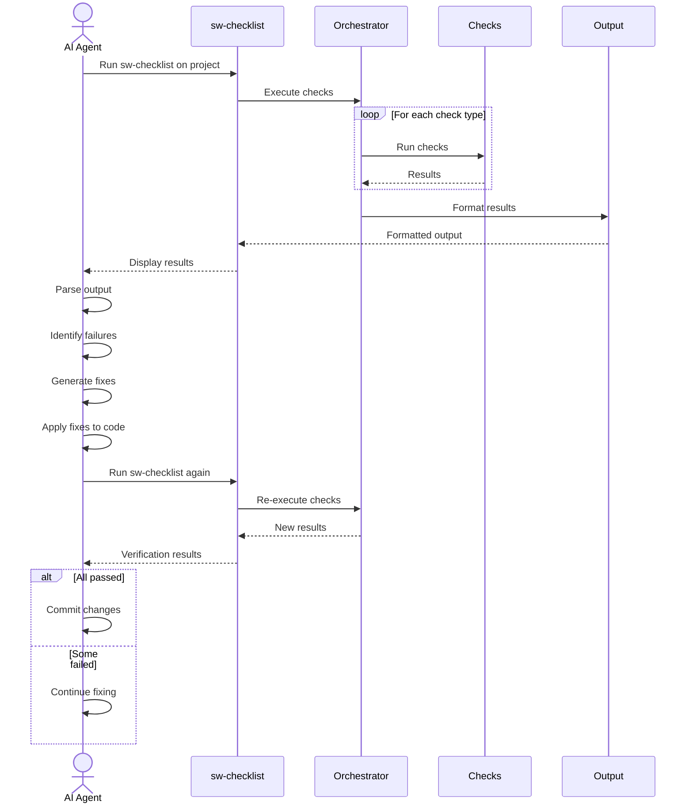

# Check Orchestration

This document details how sw-checklist coordinates and executes validation checks across different project types.

## Overview

Check orchestration is the process of determining which checks to run for each crate and coordinating their execution. The system uses a dynamic, type-based approach to select appropriate validations.

## Orchestration Architecture



## Orchestration Flow

### 1. Discovery Phase

**Purpose**: Find all crates in the project

```rust
// In main()
let cargo_tomls = discovery::find_cargo_tomls(&project_path);

if cargo_tomls.is_empty() {
    // No Rust project found
    exit(1);
}
```

**Output**: `Vec<PathBuf>` containing paths to all Cargo.toml files

**Example**:
```
[
  "/project/Cargo.toml",
  "/project/cli/Cargo.toml",
  "/project/lib/Cargo.toml",
  "/project/wasm-ui/Cargo.toml"
]
```

### 2. Type Detection Phase

**Purpose**: Classify project types to determine which checks apply

```rust
let mut has_cli = false;
let mut has_wasm = false;
let mut has_yew = false;

for cargo_toml_path in &cargo_tomls {
    let cargo_toml = fs::read_to_string(cargo_toml_path)?;

    if cargo_toml.contains("clap") {
        has_cli = true;
    }
    if cargo_toml.contains("wasm-bindgen") {
        has_wasm = true;
    }
    if cargo_toml.contains("yew") {
        has_yew = true;
    }
}
```

**Type Classification**:



**Project Type Matrix**:

| Has clap | Has wasm-bindgen | Has yew | Project Type |
|----------|------------------|---------|-------------|
| ✓ | ✓ | ✓ | CLI + Yew |
| ✓ | ✓ | ✗ | CLI + WASM |
| ✓ | ✗ | ✗ | CLI |
| ✗ | ✓ | ✓ | Yew (WASM) |
| ✗ | ✓ | ✗ | WASM |
| ✗ | ✗ | ✗ | Rust Library |

### 3. Check Execution Phase

**Purpose**: Run appropriate checks for each crate

```rust
fn run_checks(
    project_root: &Path,
    cargo_tomls: &[PathBuf],
    verbose: bool,
) -> Result<Vec<CheckResult>> {
    let mut results = Vec::new();

    for cargo_toml_path in cargo_tomls {
        // Parse Cargo.toml
        let cargo_toml = fs::read_to_string(cargo_toml_path)?;
        let cargo: toml::Value = toml::from_str(&cargo_toml)?;

        let crate_name = cargo
            .get("package")
            .and_then(|p| p.get("name"))
            .and_then(|n| n.as_str())
            .unwrap_or("unknown");

        let crate_dir = cargo_toml_path.parent().unwrap();

        // Type-specific checks
        let has_clap = cargo_toml.contains("clap");
        let is_wasm = discovery::is_wasm_crate(&cargo_toml);

        if has_clap {
            results.extend(
                checks::clap::check_rust_crate(project_root, crate_dir, verbose)?
            );
        } else if is_wasm {
            results.extend(
                checks::wasm::check_wasm_crate(project_root, crate_dir, verbose)?
            );
        }

        // Universal checks (all Rust crates)
        results.extend(
            checks::modularity::check_modularity(crate_dir, crate_name)?
        );
    }

    Ok(results)
}
```

### 4. Aggregation Phase

**Purpose**: Combine results and add project-level checks

```rust
// In main()
let mut results = run_checks(&project_root, &cargo_tomls, cli.verbose)?;

// Add project-level checks
results.push(checks::install::check_sw_install_presence());

// Project crate count check
let crate_count = cargo_tomls.len();
if crate_count > 7 {
    results.push(CheckResult::fail(
        "Project Crate Count",
        format!("Project has {} crates (max 7)", crate_count)
    ));
} else if crate_count > 4 {
    results.push(CheckResult::warn(
        "Project Crate Count",
        format!("Project has {} crates (warning at >4, max 7)", crate_count)
    ));
} else {
    results.push(CheckResult::pass(
        "Project Crate Count",
        format!("Project has {} crates (4 or fewer)", crate_count)
    ));
}
```

## Check Selection Matrix

### By Project Type

| Project Type | Clap Checks | WASM Checks | Modularity Checks | Test Checks | Install Checks |
|-------------|-------------|-------------|-------------------|-------------|----------------|
| CLI | ✓ | ✗ | ✓ | Optional | ✓ |
| CLI + WASM | ✓ | ✗ | ✓ | Optional | ✓ |
| CLI + Yew | ✓ | ✗ | ✓ | Optional | ✓ |
| WASM | ✗ | ✓ | ✓ | Optional | ✓ |
| Yew (WASM) | ✗ | ✓ | ✓ | Optional | ✓ |
| Rust Library | ✗ | ✗ | ✓ | Optional | ✓ |

### By Crate Level



## Detailed Check Workflows

### Clap Check Workflow



### WASM Check Workflow



### Modularity Check Workflow



## Error Handling in Orchestration

### Graceful Degradation Strategy



### Error Context Example

```rust
// In run_checks()
for cargo_toml_path in cargo_tomls {
    // Add context to file operations
    let cargo_toml = fs::read_to_string(cargo_toml_path)
        .with_context(|| {
            format!("Failed to read Cargo.toml at {:?}", cargo_toml_path)
        })?;

    // Add context to parsing
    let cargo: toml::Value = toml::from_str(&cargo_toml)
        .with_context(|| {
            format!("Failed to parse Cargo.toml at {:?}", cargo_toml_path)
        })?;

    // Check execution with context
    if has_clap {
        results.extend(
            checks::clap::check_rust_crate(project_root, crate_dir, verbose)
                .with_context(|| {
                    format!("Failed clap checks for crate at {:?}", crate_dir)
                })?
        );
    }
}
```

## Parallel Execution (Future)

### Current Sequential Execution

```mermaid
gantt
    title Current Sequential Processing
    dateFormat X
    axisFormat %L ms

    section Crate 1
    Clap checks     :c1, 0, 100
    Modularity      :c2, after c1, 50

    section Crate 2
    WASM checks     :c3, after c2, 80
    Modularity      :c4, after c3, 50

    section Crate 3
    Modularity      :c5, after c4, 50

    section Aggregate
    Collect results :c6, after c5, 10
```



**Total Time**: ~340ms

### Potential Parallel Execution

```mermaid
gantt
    title Potential Parallel Processing
    dateFormat X
    axisFormat %L ms

    section Crate 1
    Clap checks     :p1, 0, 100
    Modularity      :p2, 0, 50

    section Crate 2
    WASM checks     :p3, 0, 80
    Modularity      :p4, 0, 50

    section Crate 3
    Modularity      :p5, 0, 50

    section Aggregate
    Collect results :p6, after p1 p2 p3 p4 p5, 10
```



**Total Time**: ~110ms (3x speedup)

### Implementation Approach (Future)

```rust
use rayon::prelude::*;

fn run_checks_parallel(
    project_root: &Path,
    cargo_tomls: &[PathBuf],
    verbose: bool,
) -> Result<Vec<CheckResult>> {
    // Process crates in parallel
    let results: Vec<_> = cargo_tomls
        .par_iter()
        .map(|cargo_toml_path| {
            check_single_crate(project_root, cargo_toml_path, verbose)
        })
        .collect::<Result<Vec<_>>>()?
        .into_iter()
        .flatten()
        .collect();

    Ok(results)
}

fn check_single_crate(
    project_root: &Path,
    cargo_toml_path: &Path,
    verbose: bool,
) -> Result<Vec<CheckResult>> {
    // Same logic as current run_checks, but for single crate
    let mut results = Vec::new();
    // ... existing check logic ...
    Ok(results)
}
```

## Integration with AI Agents

### AI Agent Workflow



### AI-Friendly Output Structure

The orchestrator ensures output is:
- **Deterministic**: Same checks, same order
- **Parseable**: Clear status indicators (PASS/FAIL/WARN)
- **Actionable**: Specific file/function names included
- **Comprehensive**: All issues reported at once

## Performance Characteristics

### Time Complexity

```
O(n × m × l)

Where:
- n = number of crates
- m = average modules per crate
- l = average lines per module
```

### Space Complexity

```
O(c × r)

Where:
- c = number of crates
- r = average results per crate
```

### Typical Performance

| Project Size | Crates | Checks | Time |
|-------------|--------|--------|------|
| Small | 1-3 | 10-30 | <500ms |
| Medium | 4-10 | 40-100 | 1-2s |
| Large | 11-20 | 100-200 | 3-5s |

## Related Documentation

- **[Architecture Overview](Architecture-Overview)** - System architecture
- **[System Flows](System-Flows)** - Detailed execution flows
- **[Modularity Checks](Modularity-Checks)** - Modularity validation details
- **[Clap CLI Checks](Clap-CLI-Checks)** - CLI validation details
- **[WASM Checks](WASM-Checks)** - WASM validation details
