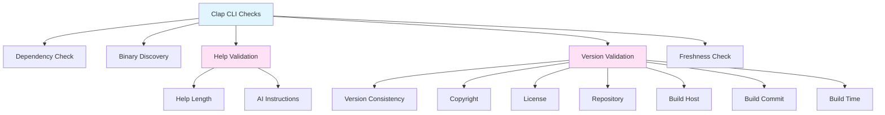
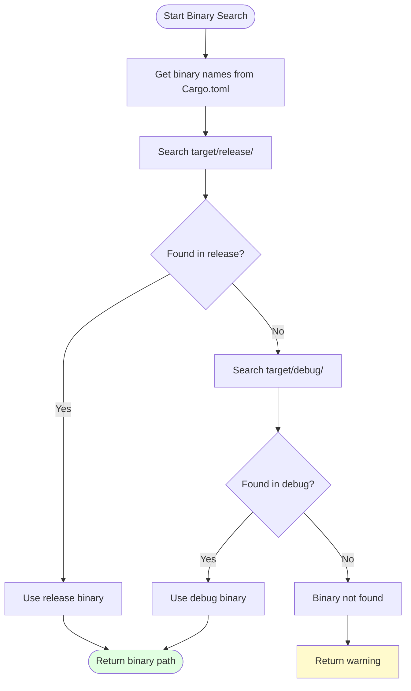
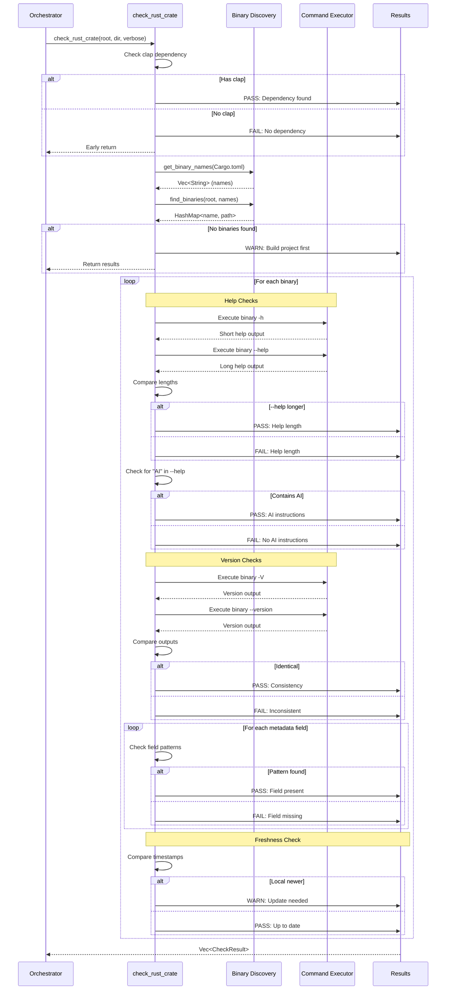

# Clap CLI Checks

Comprehensive validation for CLI tools built with the clap crate.

## Overview

Clap CLI checks ensure that command-line tools provide comprehensive, consistent, and helpful user interfaces. These checks validate help output, version information, and metadata presentation.

## Check Categories



## 1. Dependency Check

**Purpose**: Verify clap is declared in Cargo.toml

**Check Logic**:
```rust
let cargo_toml = fs::read_to_string(cargo_toml_path)?;

if cargo_toml.contains("clap") {
    CheckResult::pass(
        format!("Clap Dependency [{}]", crate_name),
        "Found clap dependency"
    )
} else {
    CheckResult::fail(
        format!("Clap Dependency [{}]", crate_name),
        "Missing clap dependency in Cargo.toml"
    )
}
```

**Why It Matters**: Ensures the project actually uses clap before running CLI-specific checks.

## 2. Binary Discovery

**Purpose**: Find compiled binaries to validate

### Binary Name Extraction

```rust
pub fn get_binary_names(cargo_toml_path: &Path) -> Result<Vec<String>> {
    let cargo_toml = fs::read_to_string(cargo_toml_path)?;
    let cargo: toml::Value = toml::from_str(&cargo_toml)?;

    let mut names = Vec::new();

    // Check [[bin]] sections
    if let Some(bins) = cargo.get("bin").and_then(|b| b.as_array()) {
        for bin in bins {
            if let Some(name) = bin.get("name").and_then(|n| n.as_str()) {
                names.push(name.to_string());
            }
        }
    }

    // If no [[bin]] sections, use package name
    if names.is_empty() {
        if let Some(name) = cargo
            .get("package")
            .and_then(|p| p.get("name"))
            .and_then(|n| n.as_str())
        {
            names.push(name.to_string());
        }
    }

    Ok(names)
}
```

### Binary Location Search



**Search Order**:
1. `target/release/{binary_name}`
2. `target/debug/{binary_name}`
3. Return "not found" warning

## 3. Help Validation

### 3.1 Help Length Check

**Purpose**: Ensure `--help` provides more detail than `-h`

**Requirement**: `--help` output must be longer than `-h` output

**Check Logic**:
```rust
let help_short = execute_binary(binary, &["-h"])?;
let help_long = execute_binary(binary, &["--help"])?;

if help_long.len() > help_short.len() {
    CheckResult::pass(
        format!("Help Length [{}]", binary_name),
        format!("--help ({} bytes) is longer than -h ({} bytes)",
                help_long.len(), help_short.len())
    )
} else {
    CheckResult::fail(
        format!("Help Length [{}]", binary_name),
        format!("--help ({} bytes) should be longer than -h ({} bytes)",
                help_long.len(), help_short.len())
    )
}
```

**Why It Matters**:
- `-h`: Quick reference for users who know the tool
- `--help`: Comprehensive guide for new users and AI agents

**Example Good Output**:

```bash
$ my-tool -h
my-tool 1.0.0
Quick description

USAGE:
    my-tool [OPTIONS]

OPTIONS:
    -h, --help       Print help
    -v, --verbose    Verbose output
```

```bash
$ my-tool --help
my-tool 1.0.0
Comprehensive description of what this tool does and why.

USAGE:
    my-tool [OPTIONS] [ARGS]

ARGS:
    <INPUT>    Input file to process

OPTIONS:
    -h, --help
            Print help (see more with '--help')

    -v, --verbose
            Enable verbose output. Shows detailed progress information
            including file processing steps and validation results.

AI CODING AGENT INSTRUCTIONS:
    When using this tool in automated workflows:
    1. Always check exit codes
    2. Parse output for structured data
    ...
```

### 3.2 AI Instructions Check

**Purpose**: Ensure `--help` includes AI agent guidance

**Requirement**: `--help` output must contain "AI" (case-insensitive)

**Check Logic**:
```rust
let help_long = execute_binary(binary, &["--help"])?;
let help_lower = help_long.to_lowercase();

if help_lower.contains("ai") {
    CheckResult::pass(
        format!("AI Agent Instructions [{}]", binary_name),
        "Found AI Coding Agent section in --help"
    )
} else {
    CheckResult::fail(
        format!("AI Agent Instructions [{}]", binary_name),
        "--help should include AI CODING AGENT INSTRUCTIONS section"
    )
}
```

**Why It Matters**: AI agents need explicit guidance on tool usage, output parsing, and error handling.

**Example AI Instructions Section**:
```
AI CODING AGENT INSTRUCTIONS:

This tool validates project conformance to standards.

USAGE FOR AI AGENTS:
  1. Run on project: $ tool /path/to/project
  2. Parse output for FAIL markers
  3. Fix reported issues
  4. Re-run until all checks pass

OUTPUT FORMAT:
  - Lines starting with "✗ FAIL" indicate failures
  - Lines starting with "⚠ WARN" indicate warnings
  - Exit code 0 = all passed, 1 = has failures

EXAMPLE WORKFLOW:
  $ tool /path/to/project
  # Review failures
  # Fix code
  $ tool /path/to/project
  # Verify all passed
```

## 4. Version Validation

### 4.1 Version Consistency Check

**Purpose**: Ensure `-V` and `--version` produce identical output

**Requirement**: Outputs must match exactly

**Check Logic**:
```rust
let version_short = execute_binary(binary, &["-V"])?;
let version_long = execute_binary(binary, &["--version"])?;

if version_short == version_long {
    CheckResult::pass(
        format!("Version Consistency [{}]", binary_name),
        "-V and --version produce identical output"
    )
} else {
    CheckResult::fail(
        format!("Version Consistency [{}]", binary_name),
        "-V and --version should produce identical output"
    )
}
```

**Why It Matters**: Consistency reduces user confusion and simplifies automation.

### 4.2 Metadata Field Checks

All metadata checks use flexible pattern matching.

#### Copyright Field

**Patterns Accepted**:
- `"copyright"`
- `"copyright (c)"`
- `"copyright:"`
- `"©"`

**Check Logic**:
```rust
check_version_field(
    &mut results,
    format!("Version Field: Copyright [{}]", binary_name),
    &version_output,
    &["copyright", "copyright (c)", "copyright:", "©"]
);
```

**Example Valid Outputs**:
```
Copyright (c) 2025 Author Name
Copyright: 2025 Author
© 2025 Company
```

#### License Field

**Patterns Accepted**:
- `"license"`
- `"mit license"`
- `"license:"`

**Example Valid Outputs**:
```
MIT License
License: MIT
License: Apache-2.0 OR MIT
```

#### Repository Field

**Patterns Accepted**:
- `"repository"`
- `"repository:"`
- `"repo:"`
- `"https://github.com"`

**Example Valid Outputs**:
```
Repository: https://github.com/user/project
Repo: https://github.com/user/project
https://github.com/user/project
```

#### Build Host Field

**Patterns Accepted**:
- `"build host"`
- `"build host:"`
- `"host:"`

**Example Valid Outputs**:
```
Build Host: my-machine.local
Host: build-server-01
Build Host: MacBook-Pro.local
```

#### Build Commit Field

**Patterns Accepted**:
- `"build commit"`
- `"commit:"`
- `"sha:"`
- `"commit sha"`

**Example Valid Outputs**:
```
Build Commit: a1b2c3d4e5f6...
Commit: a1b2c3d4
SHA: a1b2c3d4e5f6789...
Commit SHA: a1b2c3d
```

#### Build Time Field

**Patterns Accepted**:
- `"build time"`
- `"build time:"`
- `"built:"`
- `"timestamp"`

**Example Valid Outputs**:
```
Build Time: 2025-01-15T10:30:00Z
Built: 2025-01-15 10:30:00 UTC
Timestamp: 2025-01-15T10:30:00+00:00
```

### Complete Version Output Example

```bash
$ my-tool --version
my-tool 1.2.3

Copyright (c) 2025 Michael A Wright
MIT License

Repository: https://github.com/user/my-tool
Build Host: build-server.local
Build Commit: a1b2c3d4e5f6789abcdef1234567890abcdef12
Build Time: 2025-01-15T10:30:00Z
```

## 5. Binary Freshness Check

**Purpose**: Warn if local binary is newer than installed version

**Check Logic**:
```rust
pub fn check_binary_freshness(
    name: &str,
    local_binary: &Path,
    installed_binary: &Path,
) -> CheckResult {
    // Get modification times
    let local_modified = fs::metadata(local_binary)?.modified()?;

    if !installed_binary.exists() {
        return CheckResult::pass(
            format!("Binary Freshness [{}]", name),
            "No installed binary to compare"
        );
    }

    let installed_modified = fs::metadata(installed_binary)?.modified()?;

    if local_modified > installed_modified {
        CheckResult::warn(
            format!("Binary Freshness [{}]", name),
            format!(
                "Local binary {} is newer than installed version. \
                 Run acceptance test and sw-install -p . to update",
                name
            )
        )
    } else {
        CheckResult::pass(
            format!("Binary Freshness [{}]", name),
            "Installed binary is up to date"
        )
    }
}
```

**Installation Locations Checked**:
- `~/.local/softwarewrighter/bin/{binary_name}`
- Future: Additional configurable locations

**Why It Matters**: Ensures developers are testing the version they'll deploy.

## Complete Check Flow



## Implementation with Clap

### Recommended Clap Configuration

```rust
use clap::Parser;

const VERSION: &str = env!("CARGO_PKG_VERSION");
const BUILD_COMMIT: &str = env!("BUILD_COMMIT_SHA");
const BUILD_TIME: &str = env!("BUILD_TIMESTAMP");
const BUILD_HOST: &str = env!("BUILD_HOST");
const REPO: &str = env!("CARGO_PKG_REPOSITORY");

const LONG_VERSION: &str = const_format::formatcp!(
    "{}\n\n\
     Copyright (c) 2025 Your Name\n\
     MIT License\n\n\
     Repository: {}\n\
     Build Host: {}\n\
     Build Commit: {}\n\
     Build Time: {}",
    VERSION, REPO, BUILD_HOST, BUILD_COMMIT, BUILD_TIME
);

const AI_INSTRUCTIONS: &str = r#"
AI CODING AGENT INSTRUCTIONS:

[Your AI-specific guidance here]

USAGE FOR AI AGENTS:
  1. [Step-by-step workflow]
  2. [Output parsing guidance]
  3. [Error handling approach]

EXAMPLE WORKFLOW:
  $ your-tool [example command]
  # [Expected output]
"#;

#[derive(Parser)]
#[command(name = "your-tool")]
#[command(version = VERSION)]
#[command(long_version = LONG_VERSION)]
#[command(about = "Brief description")]
#[command(long_about = "Detailed description\n\nMore details...")]
#[command(after_long_help = AI_INSTRUCTIONS)]
struct Cli {
    // Your arguments
}
```

### Build Script (build.rs)

```rust
use std::process::Command;

fn main() {
    // Git commit SHA
    let commit = Command::new("git")
        .args(["rev-parse", "HEAD"])
        .output()
        .expect("Failed to get git commit");

    println!(
        "cargo:rustc-env=BUILD_COMMIT_SHA={}",
        String::from_utf8_lossy(&commit.stdout).trim()
    );

    // Build timestamp
    let timestamp = chrono::Utc::now().to_rfc3339();
    println!("cargo:rustc-env=BUILD_TIMESTAMP={}", timestamp);

    // Build host
    let hostname = hostname::get()
        .unwrap()
        .to_string_lossy()
        .to_string();
    println!("cargo:rustc-env=BUILD_HOST={}", hostname);
}
```

### Cargo.toml Dependencies

```toml
[dependencies]
clap = { version = "4.5", features = ["derive", "cargo", "wrap_help"] }
const_format = "0.2"

[build-dependencies]
chrono = "0.4"
hostname = "0.4"
```

## Common Issues and Solutions

### Issue: --help Not Longer Than -h

**Problem**:
```
✗ FAIL | Help Length [my-tool]
       --help (250 bytes) should be longer than -h (250 bytes)
```

**Solution**: Use `long_about` and `after_long_help`:
```rust
#[command(about = "Short description")]
#[command(long_about = "Detailed description with examples...")]
#[command(after_long_help = AI_INSTRUCTIONS)]
```

### Issue: Missing AI Instructions

**Problem**:
```
✗ FAIL | AI Agent Instructions [my-tool]
       --help should include AI CODING AGENT INSTRUCTIONS section
```

**Solution**: Add `after_long_help`:
```rust
const AI_INSTRUCTIONS: &str = r#"
AI CODING AGENT INSTRUCTIONS:
...
"#;

#[command(after_long_help = AI_INSTRUCTIONS)]
```

### Issue: Missing Build Metadata

**Problem**:
```
✗ FAIL | Version Field: Build Commit [my-tool]
       Version output should contain Build Commit information
```

**Solution**:
1. Create `build.rs`
2. Generate build-time constants
3. Use in `LONG_VERSION`

## Related Documentation

- **[Architecture Overview](Architecture-Overview)** - System design
- **[Check Orchestration](Check-Orchestration)** - How checks run
- **[Component Details](Component-Details)** - Implementation details
