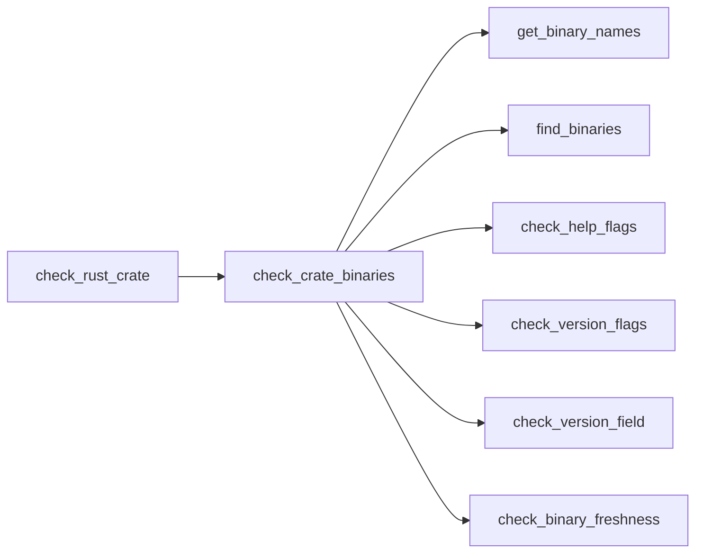
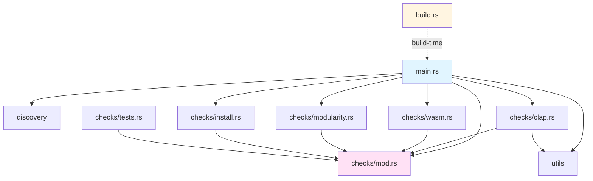

# Component Details

Detailed documentation for each component in the sw-checklist system.

## Table of Contents

1. [Core Components](#core-components)
2. [Check Modules](#check-modules)
3. [Utility Modules](#utility-modules)
4. [Data Structures](#data-structures)
5. [Build System](#build-system)

## Core Components

### main.rs - Entry Point

**Location**: `src/main.rs`

**Purpose**: Application entry point, CLI definition, and main orchestration logic

**Key Structures**:

```rust
#[derive(Parser)]
struct Cli {
    #[arg(default_value = ".")]
    project_path: PathBuf,

    #[arg(short, long)]
    verbose: bool,
}
```

**Key Functions**:

#### `main() -> Result<()>`

**Purpose**: Application entry point

**Flow**:
1. Parse CLI arguments using clap
2. Canonicalize project path
3. Find all Cargo.toml files
4. Detect project types
5. Run checks
6. Add project-level checks
7. Print results and summary
8. Exit with appropriate code

**Exit Codes**:
- `0`: All checks passed (warnings allowed)
- `1`: One or more checks failed

#### `run_checks(project_root, cargo_tomls, verbose) -> Result<Vec<CheckResult>>`

**Purpose**: Orchestrate check execution for all crates

**Parameters**:
- `project_root: &Path` - Root directory of the project
- `cargo_tomls: &[PathBuf]` - Paths to all Cargo.toml files
- `verbose: bool` - Enable verbose output

**Algorithm**:
```
For each Cargo.toml:
  1. Read and parse the file
  2. Extract crate name
  3. Check dependencies (clap, wasm-bindgen, yew)
  4. If has clap: run clap checks
  5. If has wasm: run wasm checks
  6. Always: run modularity checks
  7. Collect all results
Return aggregated results
```

**Error Handling**:
- Gracefully handles missing files (continues with other crates)
- Adds context to errors with file paths
- Returns partial results on non-fatal errors

#### `print_results(results: &[CheckResult])`

**Purpose**: Format and display check results to terminal

**Output Format**:
```
Check Results:
================================================================================
✓ PASS | Check Name
       Success message

⚠ WARN | Warning Name
       Warning message

✗ FAIL | Failure Name
       Failure message with guidance
```

**Constants**:

```rust
const VERSION: &str = env!("CARGO_PKG_VERSION");
const BUILD_COMMIT: &str = env!("BUILD_COMMIT_SHA");
const BUILD_TIME: &str = env!("BUILD_TIMESTAMP");
const BUILD_HOST_NAME: &str = env!("BUILD_HOST");
const REPO: &str = env!("CARGO_PKG_REPOSITORY");

const LONG_VERSION: &str = const_format::formatcp!(
    "{}\n\nCopyright (c) 2025 Michael A Wright\nMIT License\n\n...",
    VERSION, /* ... */
);

const AI_AGENT_INSTRUCTIONS: &str = r#"
AI CODING AGENT INSTRUCTIONS:
...
"#;
```

### discovery.rs - Project Discovery

**Location**: `src/discovery.rs`

**Purpose**: Find and identify Rust crates in the project tree

**Key Functions**:

#### `find_cargo_tomls(path: &Path) -> Vec<PathBuf>`

**Purpose**: Recursively find all Cargo.toml files

**Algorithm**:
```
Use walkdir to traverse directory tree
Filter for entries named "Cargo.toml"
Collect paths into vector
Return sorted by modification time
```

**Dependencies**: `walkdir` crate

**Example**:
```rust
let cargo_files = find_cargo_tomls(Path::new("/path/to/project"));
// Returns: [
//   "/path/to/project/Cargo.toml",
//   "/path/to/project/crate1/Cargo.toml",
//   "/path/to/project/crate2/Cargo.toml"
// ]
```

#### `is_wasm_crate(cargo_toml: &str) -> bool`

**Purpose**: Detect if a crate is a WASM project

**Detection Logic**:
```rust
cargo_toml.contains("wasm-bindgen") ||
cargo_toml.contains("crate-type = [\"cdylib\"]")
```

**Usage**:
```rust
let cargo_toml = fs::read_to_string("Cargo.toml")?;
if is_wasm_crate(&cargo_toml) {
    // Run WASM-specific checks
}
```

## Check Modules

### checks/mod.rs - Check Result Model

**Location**: `src/checks/mod.rs`

**Purpose**: Define common check result structure and factory methods

**Data Structure**:

```rust
#[derive(Debug)]
pub struct CheckResult {
    pub name: String,
    pub passed: bool,
    pub message: String,
    pub is_warning: bool,
}
```

**Factory Methods**:

```rust
impl CheckResult {
    pub fn pass(name: impl Into<String>, message: impl Into<String>) -> Self

    pub fn fail(name: impl Into<String>, message: impl Into<String>) -> Self

    pub fn warn(name: impl Into<String>, message: impl Into<String>) -> Self
}
```

**Design Pattern**: Factory pattern for type-safe construction

**Usage Examples**:
```rust
// Passing check
CheckResult::pass(
    "Dependency Check",
    "Found clap dependency"
)

// Failed check
CheckResult::fail(
    format!("Function LOC [{}]", crate_name),
    format!("Function '{}' has {} lines (max 50)", fn_name, loc)
)

// Warning (passes but indicates potential issue)
CheckResult::warn(
    format!("Module Function Count [{}]", crate_name),
    format!("Module {} has {} functions (warning at >4, max 7)",
            module, count)
)
```

### checks/clap.rs - Clap CLI Validation

**Location**: `src/checks/clap.rs`

**Purpose**: Validate CLI tools using clap

**Key Functions**:

#### `check_rust_crate(project_root, crate_dir, verbose) -> Result<Vec<CheckResult>>`

**Checks Performed**:
1. Clap dependency presence
2. Binary existence
3. Help output validation (-h vs --help)
4. AI agent instructions in --help
5. Version output validation (-V vs --version)
6. Version metadata fields
7. Binary freshness

**Detailed Check Flow**:



**Helper Functions**:

- `get_binary_names(cargo_toml_path) -> Vec<String>`: Extract binary names from Cargo.toml
- `find_binaries(project_root, names) -> HashMap<String, PathBuf>`: Find built binaries
- `check_help_flags(binary, name) -> Vec<CheckResult>`: Validate help output
- `check_version_flags(binary, name) -> Vec<CheckResult>`: Validate version output
- `check_version_field(results, field_name, output, patterns)`: Check for required fields

**Version Field Patterns**:
```rust
// Copyright field accepts any of:
["copyright", "copyright (c)", "copyright:"]

// License field accepts:
["license", "mit license", "license:"]

// Repository field accepts:
["repository", "repository:", "repo:", "https://github.com"]

// Build Host field accepts:
["build host", "build host:", "host:"]

// Build Commit field accepts:
["build commit", "commit:", "sha:"]

// Build Time field accepts:
["build time", "build time:", "built:", "timestamp"]
```

### checks/modularity.rs - Modularity Validation

**Location**: `src/checks/modularity.rs`

**Purpose**: Validate code modularity following Miller's Law (7±2 rule)

**Key Function**:

#### `check_modularity(crate_dir, crate_name) -> Result<Vec<CheckResult>>`

**Checks Performed**:

1. **Function LOC** (Lines of Code)
   - ✓ Pass: ≤25 lines
   - ⚠ Warn: 26-50 lines
   - ✗ Fail: >50 lines

2. **Module Function Count**
   - ✓ Pass: ≤4 functions
   - ⚠ Warn: 5-7 functions
   - ✗ Fail: >7 functions

3. **File LOC** (File Lines of Code)
   - ✓ Pass: ≤350 lines
   - ⚠ Warn: 351-500 lines
   - ✗ Fail: >500 lines

4. **Crate Module Count**
   - ✓ Pass: ≤4 modules
   - ⚠ Warn: 5-7 modules
   - ✗ Fail: >7 modules

**Algorithm Detail**:

```rust
// Function LOC counting
fn count_function_loc(file_path: &Path) -> Result<Vec<CheckResult>> {
    let lines = read_file_lines(file_path)?;
    let mut i = 0;
    let mut results = Vec::new();

    while i < lines.len() {
        if is_function_signature(&lines[i]) {
            let fn_name = extract_function_name(&lines[i]);

            // Find opening brace
            let brace_line = find_opening_brace(&lines, i);

            // Count braces to find closing brace
            let mut brace_count = 0;
            let mut end_line = brace_line;

            for (idx, line) in lines[brace_line..].iter().enumerate() {
                for ch in line.chars() {
                    if ch == '{' { brace_count += 1; }
                    if ch == '}' { brace_count -= 1; }
                    if brace_count == 0 {
                        end_line = brace_line + idx;
                        break;
                    }
                }
                if brace_count == 0 { break; }
            }

            // Calculate LOC
            let loc = end_line - i + 1;

            // Check thresholds
            if loc > 50 {
                results.push(CheckResult::fail(...));
            } else if loc > 25 {
                results.push(CheckResult::warn(...));
            } else {
                results.push(CheckResult::pass(...));
            }

            i = end_line + 1;
        } else {
            i += 1;
        }
    }

    Ok(results)
}
```

**Helper Functions**:

- `extract_function_name(line: &str) -> String`: Parse function name from signature
- `is_function_signature(line: &str) -> bool`: Detect function definition
- `find_opening_brace(lines, start) -> usize`: Locate opening brace

**Design Decisions**:

- Uses simple line-based parsing (not full AST)
- Fast and sufficient for 99% of cases
- Counts test functions (intentional - tests should be modular too)
- Progressive thresholds (warn before fail)

### checks/wasm.rs - WASM Validation

**Location**: `src/checks/wasm.rs`

**Purpose**: Validate WASM projects

**Key Function**:

#### `check_wasm_crate(project_root, crate_dir, verbose) -> Result<Vec<CheckResult>>`

**Checks Performed**:

1. **HTML Files**: Verify index.html exists and contains favicon reference
2. **Favicon**: Check for favicon.ico file
3. **Footer Metadata**: Scan Rust source for footer with required fields:
   - Copyright
   - License
   - Repository URL
   - Build info

**HTML Validation**:
```rust
// Check index.html exists
let index_html = crate_dir.join("index.html");
if !index_html.exists() {
    return CheckResult::fail("HTML File", "Missing index.html");
}

// Check favicon reference
let html_content = fs::read_to_string(&index_html)?;
if !html_content.contains("favicon.ico") {
    return CheckResult::fail("Favicon Reference",
                            "index.html doesn't reference favicon.ico");
}
```

**Footer Validation**:
```rust
// Scan all .rs files for footer
for rs_file in rs_files {
    let content = fs::read_to_string(rs_file)?;

    // Look for footer-related code
    if content.contains("footer") || content.contains("Footer") {
        // Check for required fields
        check_footer_field(&content, "Copyright", &["copyright", "©"]);
        check_footer_field(&content, "License", &["license", "MIT"]);
        check_footer_field(&content, "Repository", &["github.com", "repo"]);
    }
}
```

### checks/install.rs - Installation Validation

**Location**: `src/checks/install.rs`

**Purpose**: Validate sw-install presence and binary freshness

**Key Functions**:

#### `check_sw_install_presence() -> CheckResult`

**Purpose**: Check if sw-install tool is installed

**Logic**:
```rust
let sw_install_path = home_dir()
    .unwrap()
    .join(".local/softwarewrighter/bin/sw-install");

if sw_install_path.exists() {
    CheckResult::pass("sw-install Presence", "sw-install is installed")
} else {
    CheckResult::warn(
        "sw-install Presence",
        "sw-install is not installed (optional tool)"
    )
}
```

**Note**: This is always a warning, never a failure

#### `check_binary_freshness(name, local_path, installed_path) -> CheckResult`

**Purpose**: Compare timestamps of local vs installed binaries

**Logic**:
```rust
let local_modified = fs::metadata(local_path)?.modified()?;
let installed_modified = fs::metadata(installed_path)?.modified()?;

if local_modified > installed_modified {
    CheckResult::warn(
        format!("Binary Freshness [{}]", name),
        format!(
            "Local binary {} is newer than installed version. \
             Run acceptance test and sw-install to update.",
            name
        )
    )
} else {
    CheckResult::pass(
        format!("Binary Freshness [{}]", name),
        "Installed binary is up to date"
    )
}
```

### checks/tests.rs - Test Validation

**Location**: `src/checks/tests.rs`

**Purpose**: Validate test presence and organization

**Key Function**:

#### `check_tests(crate_dir, crate_name) -> Result<Vec<CheckResult>>`

**Checks Performed**:

1. **Test Directory**: Check for `tests/` directory
2. **Unit Tests**: Look for `#[test]` or `#[cfg(test)]` annotations
3. **Integration Tests**: Check for files in `tests/`
4. **WASM Tests**: For WASM projects, check for Jest configuration

**Example Logic**:
```rust
let tests_dir = crate_dir.join("tests");
let has_test_dir = tests_dir.exists();

// Check source files for test annotations
let src_dir = crate_dir.join("src");
let mut has_unit_tests = false;

for rs_file in find_rs_files(&src_dir) {
    let content = fs::read_to_string(rs_file)?;
    if content.contains("#[test]") || content.contains("#[cfg(test)]") {
        has_unit_tests = true;
        break;
    }
}

if has_test_dir || has_unit_tests {
    CheckResult::pass("Test Presence", "Tests found")
} else {
    CheckResult::warn("Test Presence", "No tests found (recommended)")
}
```

## Utility Modules

### utils.rs - Utility Functions

**Location**: `src/utils.rs`

**Purpose**: Shared utility functions

**Common Functions** (examples):

```rust
// Get binary names from Cargo.toml
pub fn get_binary_names(cargo_toml_path: &Path) -> Result<Vec<String>>

// Execute command and capture output
pub fn execute_command(binary: &Path, args: &[&str]) -> Result<String>

// Find files matching pattern
pub fn find_files(dir: &Path, pattern: &str) -> Vec<PathBuf>
```

## Data Structures

### CheckResult

**Purpose**: Unified representation of check results

**Fields**:
- `name: String` - Human-readable check name
- `passed: bool` - Whether check passed
- `message: String` - Detailed message explaining result
- `is_warning: bool` - True for warnings (non-blocking)

**Invariants**:
- If `is_warning` is true, `passed` must be true
- If `passed` is false, `is_warning` must be false
- `name` and `message` must not be empty

**Display Mapping**:
```
(passed: true,  is_warning: false) → "✓ PASS"
(passed: true,  is_warning: true)  → "⚠ WARN"
(passed: false, is_warning: false) → "✗ FAIL"
(passed: false, is_warning: true)  → INVALID STATE
```

## Build System

### build.rs - Build Script

**Location**: `build.rs`

**Purpose**: Generate build-time metadata

**Generated Constants**:

```rust
// In build.rs:
fn main() {
    // Git commit SHA
    let commit_output = Command::new("git")
        .args(["rev-parse", "HEAD"])
        .output()
        .expect("Failed to get git commit");
    println!(
        "cargo:rustc-env=BUILD_COMMIT_SHA={}",
        String::from_utf8_lossy(&commit_output.stdout).trim()
    );

    // Build timestamp
    let now = chrono::Utc::now();
    println!(
        "cargo:rustc-env=BUILD_TIMESTAMP={}",
        now.to_rfc3339()
    );

    // Build host
    let hostname = hostname::get()
        .unwrap()
        .to_string_lossy()
        .to_string();
    println!("cargo:rustc-env=BUILD_HOST={}", hostname);
}
```

**Usage in main.rs**:
```rust
const BUILD_COMMIT: &str = env!("BUILD_COMMIT_SHA");
const BUILD_TIME: &str = env!("BUILD_TIMESTAMP");
const BUILD_HOST_NAME: &str = env!("BUILD_HOST");

const LONG_VERSION: &str = const_format::formatcp!(
    "{}\n\nCopyright (c) 2025 Michael A Wright\n...\n\
     Build Host: {}\nBuild Commit: {}\nBuild Time: {}",
    VERSION, BUILD_HOST_NAME, BUILD_COMMIT, BUILD_TIME
);
```

**Build Dependencies**:
```toml
[build-dependencies]
chrono = "0.4"
hostname = "0.4"
```

## Module Dependency Graph



## File Organization

```
sw-checklist/
├── src/
│   ├── main.rs              # Entry point, CLI, orchestration
│   ├── discovery.rs         # Project discovery
│   ├── utils.rs             # Utility functions
│   └── checks/
│       ├── mod.rs           # CheckResult definition
│       ├── clap.rs          # Clap CLI validation
│       ├── wasm.rs          # WASM validation
│       ├── modularity.rs    # Modularity validation
│       ├── tests.rs         # Test validation
│       └── install.rs       # Installation validation
├── build.rs                 # Build-time metadata generation
├── Cargo.toml              # Project manifest
└── tests/                  # Integration tests (if any)
```

## Testing Organization

All tests are embedded in source files using `#[cfg(test)]` modules:

```rust
#[cfg(test)]
mod tests {
    use super::*;
    use tempfile::tempdir;

    #[test]
    fn test_something() {
        // Test implementation
    }
}
```

**Test Categories**:
- Unit tests: In same file as implementation
- Integration tests: In `src/main.rs` tests module
- Test fixtures: Created with `tempfile::tempdir()`

## Related Documentation

- **[Architecture Overview](Architecture-Overview)** - High-level system design
- **[System Flows](System-Flows)** - Execution sequences and flows
- **[Check Orchestration](Check-Orchestration)** - How checks are coordinated
- **[Modularity Checks](Modularity-Checks)** - Modularity validation details
