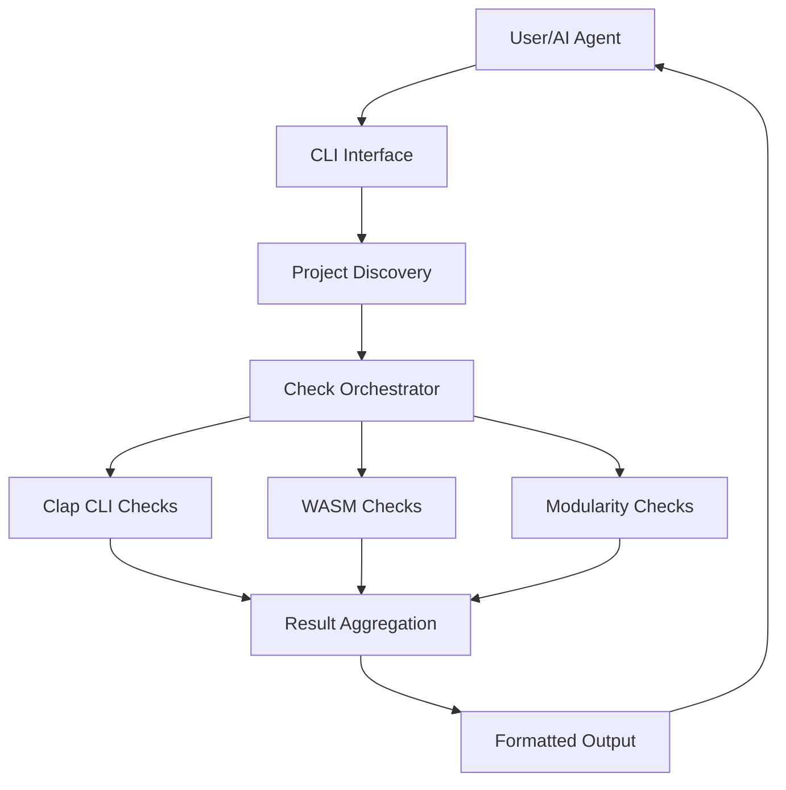

# sw-checklist Wiki

Welcome to the **sw-checklist** documentation wiki! This tool validates Software Wrighter LLC project conformance requirements.

## Quick Links

### Architecture Documentation
- **[Architecture Overview](Architecture-Overview)** - High-level system architecture with block diagrams
- **[System Flows](System-Flows)** - Sequence diagrams and execution flows
- **[Component Details](Component-Details)** - Detailed component documentation

### Check Documentation
- **[Check Orchestration](Check-Orchestration)** - How validation checks are orchestrated
- **[Modularity Checks](Modularity-Checks)** - Function, module, and crate size validation
- **[Clap CLI Checks](Clap-CLI-Checks)** - CLI help and version validation
- **[WASM Checks](WASM-Checks)** - WASM project validation

### Additional Resources
- **[Design Decisions](Design-Decisions)** - Key architectural decisions and rationale
- **[Testing Strategy](Testing-Strategy)** - Test organization and coverage

## Project Overview

`sw-checklist` is a CLI tool that automatically validates Rust projects against Software Wrighter LLC standards. It checks:

- **CLI Projects**: Help/version output, metadata, AI agent instructions
- **WASM Projects**: HTML files, favicon, footer metadata
- **All Projects**: Modularity (function LOC, module size, crate organization)

## Key Features

### Automatic Detection
- Discovers all crates in a workspace
- Detects project type (CLI, WASM, Library)
- Runs appropriate checks automatically

### Modularity Validation
Based on Miller's Law (7±2 rule):
- Functions: warn >25 LOC, fail >50 LOC
- Modules: warn >4 functions, fail >7 functions
- Crates: warn >4 modules, fail >7 modules
- Projects: warn >4 crates, fail >7 crates

### Progressive Feedback
- Warnings before failures
- Clear, actionable error messages
- Supports both human and AI agent workflows

## Architecture at a Glance



## Getting Started

### Installation
```bash
git clone https://github.com/softwarewrighter/sw-checklist.git
cd sw-checklist
cargo build --release
```

### Basic Usage
```bash
# Check current directory
sw-checklist

# Check specific project
sw-checklist /path/to/project

# Verbose output
sw-checklist -v /path/to/project
```

## Documentation Navigation

### For Developers
1. Start with [Architecture Overview](Architecture-Overview) to understand the system design
2. Review [System Flows](System-Flows) to see how data moves through the system
3. Dive into [Component Details](Component-Details) for implementation specifics

### For Contributors
1. Read [Design Decisions](Design-Decisions) to understand architectural choices
2. Review [Testing Strategy](Testing-Strategy) for test organization
3. Check specific check documentation for the area you're working on

### For AI Agents
The tool includes dedicated AI agent instructions in `--help` output:
```bash
sw-checklist --help
```

See [Check Orchestration](Check-Orchestration) for integration patterns.

## Project Statistics

- **Language**: Rust
- **Main Dependencies**: clap, walkdir, anyhow, toml
- **Test Count**: 26 tests (all passing)
- **Code Organization**: 9 source files across 4 modules

## Contact & Contributing

- **Repository**: https://github.com/softwarewrighter/sw-checklist
- **License**: MIT License
- **Author**: Michael A Wright / Software Wrighter LLC
