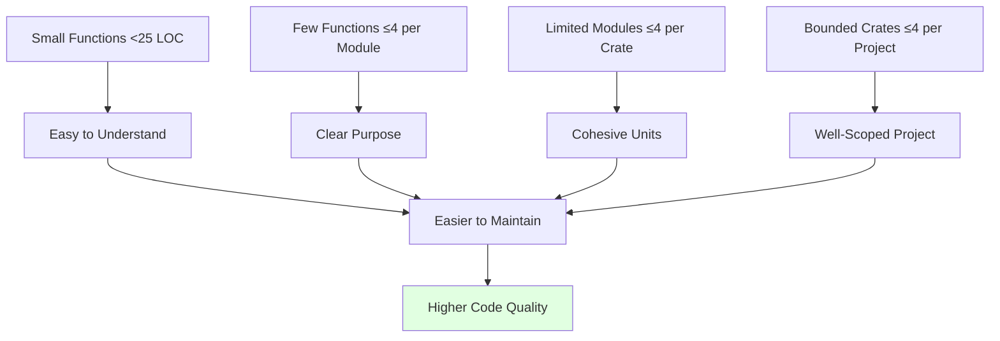
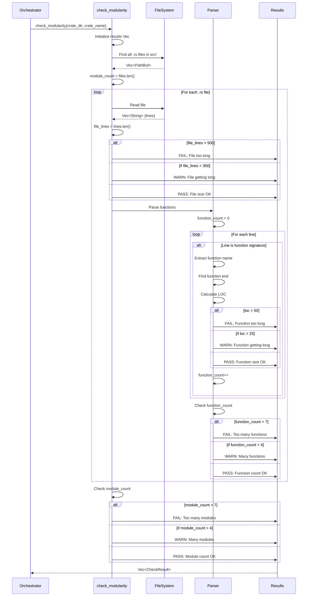

# Modularity Checks

Detailed documentation on modularity validation based on Miller's Law (7±2 rule).

## Overview

Modularity checks validate that code is organized into manageable,comprehensible units. These checks are based on cognitive science research showing humans can effectively manage 7±2 items in working memory (Miller's Law).

## Philosophy

### Why Modularity Matters



### Miller's Law (7±2)

**Research Basis**: George A. Miller's 1956 paper "The Magical Number Seven, Plus or Minus Two"

**Application to Code**:
- **Ideal**: 4 or fewer items (conservative, high quality)
- **Warning**: 5-7 items (approaching cognitive limit)
- **Failure**: >7 items (exceeds working memory capacity)

## Check Categories

### 1. Function LOC (Lines of Code)

**Purpose**: Ensure functions remain focused and comprehensible

**Thresholds**:
- ✓ **Pass**: ≤25 lines
- ⚠ **Warn**: 26-50 lines
- ✗ **Fail**: >50 lines

**Rationale**: Functions should do one thing well. Large functions typically have multiple responsibilities and are harder to test and maintain.

#### Detection Algorithm

```mermaid
flowchart TD
    Start([Start Function LOC Check]) --> ReadFile[Read source file line by line]
    ReadFile --> InitVars[i = 0, function_count = 0]
    InitVars --> Loop{i < lines.len}

    Loop -->|Yes| CheckLine{Line matches function signature?}
    Loop -->|No| Return([Return Results])

    CheckLine -->|No| Increment[i++]
    CheckLine -->|Yes| Extract[Extract function name]

    Increment --> Loop

    Extract --> FindBrace[Find opening brace]
    FindBrace --> InitCount[brace_count = 0 brace_line = current]

    InitCount --> BraceLoop{Scan lines}

    BraceLoop --> ReadChar{For each char}
    ReadChar -->|char = '{'| IncBrace[brace_count++]
    ReadChar -->|char = '}'| DecBrace[brace_count--]
    ReadChar -->|other| BraceLoop

    IncBrace --> CheckZero{brace_count == 0?}
    DecBrace --> CheckZero

    CheckZero -->|No| BraceLoop
    CheckZero -->|Yes| CalcLOC[loc = end_line - start_line + 1]

    CalcLOC --> Threshold{Check LOC}

    Threshold -->|loc > 50| Fail[Add FAIL result]
    Threshold -->|loc > 25| Warn[Add WARN result]
    Threshold -->|loc ≤ 25| Pass[Add PASS result]

    Fail --> Jump[i = end_line + 1]
    Warn --> Jump
    Pass --> Jump

    Jump --> Loop

    style Start fill:#e1f5ff
    style Return fill:#e1ffe1
```

#### Function Pattern Matching

**Detects**:
```rust
// Public functions
pub fn function_name()
pub fn function_name(args: Type)
pub fn function_name<T>(args: T)

// Private functions
fn function_name()
fn function_name(args: Type)

// Async functions
async fn function_name()
pub async fn function_name()

// Unsafe functions
unsafe fn function_name()
pub unsafe fn function_name()

// Const functions
const fn function_name()
pub const fn function_name()
```

**Does NOT detect** (intentionally):
- Trait method declarations (no body)
- Function type definitions
- Function calls
- Comments mentioning "fn"

#### Example Results

**Pass Example**:
```
✓ PASS | Function LOC [my-crate] - process_data
       Function 'process_data' in processor.rs has 18 lines
```

**Warning Example**:
```
⚠ WARN | Function LOC [my-crate] - complex_calculation
       Function 'complex_calculation' in math.rs has 42 lines (warning at >25, max 50)
       Consider: Break into smaller helper functions
```

**Failure Example**:
```
✗ FAIL | Function LOC [my-crate] - handle_everything
       Function 'handle_everything' in main.rs has 87 lines (max 50)
       Action Required: Extract distinct responsibilities to separate functions
```

### 2. Module Function Count

**Purpose**: Ensure modules maintain focused purpose

**Thresholds**:
- ✓ **Pass**: ≤4 functions
- ⚠ **Warn**: 5-7 functions
- ✗ **Fail**: >7 functions

**Rationale**: Modules should have a clear, single purpose. Too many functions indicate the module is doing too much.

#### Counting Logic

```rust
// After processing all functions in a file
let function_count = /* count of all functions found */;

if function_count > 7 {
    CheckResult::fail(
        format!("Module Function Count [{}] - {}", crate_name, file_name),
        format!("Module {} has {} functions (max 7). \
                 Consider: Split into multiple focused modules",
                file_name, function_count)
    )
} else if function_count > 4 {
    CheckResult::warn(
        format!("Module Function Count [{}] - {}", crate_name, file_name),
        format!("Module {} has {} functions (warning at >4, max 7)",
                file_name, function_count)
    )
} else {
    CheckResult::pass(
        format!("Module Function Count [{}] - {}", crate_name, file_name),
        format!("Module {} has {} functions (4 or fewer)", file_name, function_count)
    )
}
```

#### What Counts as a Function?

**Included**:
- Public functions (`pub fn`)
- Private functions (`fn`)
- Test functions (`#[test]`)
- Associated functions (`impl MyStruct { fn ... }`)
- Trait implementations

**Rationale for including tests**: Test functions are code that needs maintenance. Large test modules indicate complex testing requirements that may benefit from organization.

#### Example Results

**Pass**:
```
✓ PASS | Module Function Count [my-crate] - utils.rs
       Module utils.rs has 3 functions (4 or fewer)
```

**Warning**:
```
⚠ WARN | Module Function Count [my-crate] - processor.rs
       Module processor.rs has 6 functions (warning at >4, max 7)
```

**Failure**:
```
✗ FAIL | Module Function Count [my-crate] - helpers.rs
       Module helpers.rs has 12 functions (max 7)
       Consider: Split into multiple focused modules (e.g., string_helpers.rs,
       numeric_helpers.rs)
```

### 3. File LOC (File Lines of Code)

**Purpose**: Ensure source files remain manageable

**Thresholds**:
- ✓ **Pass**: ≤350 lines
- ⚠ **Warn**: 351-500 lines
- ✗ **Fail**: >500 lines

**Rationale**: Large files are difficult to navigate and often indicate too many responsibilities.

#### Counting Logic

```rust
let file_lines = lines.len();

if file_lines > 500 {
    CheckResult::fail(
        format!("File LOC [{}] - {}", crate_name, file_name),
        format!("File {} has {} lines (max 500). \
                 Extract modules to separate files",
                file_name, file_lines)
    )
} else if file_lines > 350 {
    CheckResult::warn(
        format!("File LOC [{}] - {}", crate_name, file_name),
        format!("File {} has {} lines (warning at >350, max 500)",
                file_name, file_lines)
    )
} else {
    CheckResult::pass(
        format!("File LOC [{}] - {}", crate_name, file_name),
        format!("File {} has {} lines (350 or fewer)", file_name, file_lines)
    )
}
```

#### What Counts?

**Included in count**:
- All lines in the file (including blank lines)
- Comments
- Code
- Documentation comments
- Test code

**Rationale**: Total file size affects navigability regardless of content type.

### 4. Crate Module Count

**Purpose**: Ensure crates remain cohesive

**Thresholds**:
- ✓ **Pass**: ≤4 modules
- ⚠ **Warn**: 5-7 modules
- ✗ **Fail**: >7 modules

**Rationale**: Crates should represent a cohesive unit of functionality. Too many modules suggest the crate's scope is too broad.

#### Counting Logic

```rust
// Count all .rs files in src/ directory
let rs_files: Vec<_> = WalkDir::new(crate_dir.join("src"))
    .into_iter()
    .filter_map(|e| e.ok())
    .filter(|e| e.path().extension() == Some(OsStr::new("rs")))
    .collect();

let module_count = rs_files.len();

if module_count > 7 {
    CheckResult::fail(
        format!("Crate Module Count [{}]", crate_name),
        format!("Crate has {} modules (max 7). \
                 Consider: Split into multiple crates",
                module_count)
    )
} else if module_count > 4 {
    CheckResult::warn(
        format!("Crate Module Count [{}]", crate_name),
        format!("Crate has {} modules (warning at >4, max 7)", module_count)
    )
} else {
    CheckResult::pass(
        format!("Crate Module Count [{}]", crate_name),
        format!("Crate has {} modules (4 or fewer)", module_count)
    )
}
```

#### What Counts as a Module?

**Included**:
- `lib.rs` or `main.rs`
- All `.rs` files in `src/`
- Submodules in subdirectories

**Example Structure**:
```
src/
├── lib.rs         # Module 1
├── parser.rs      # Module 2
├── validator.rs   # Module 3
├── output.rs      # Module 4
└── utils.rs       # Module 5 (warning threshold)
```

## Check Execution

### Complete Flow



## Edge Cases

### Empty Files

```rust
// Empty or nearly empty file
// src/placeholder.rs
// (no functions)

// Result: PASS for all checks
// Rationale: No violations present
```

### Test Modules

```rust
// src/processor.rs
pub fn process() { /* ... */ }

#[cfg(test)]
mod tests {
    #[test]
    fn test_process() { /* ... */ }

    #[test]
    fn test_edge_case() { /* ... */ }
}

// Both test functions are counted
// Rationale: Tests need maintenance too
```

### Trait Implementations

```rust
impl MyTrait for MyStruct {
    fn method1() { /* ... */ }  // Counted
    fn method2() { /* ... */ }  // Counted
}

// All implementation functions are counted
```

### Nested Functions

```rust
fn outer() {
    // Start: line 1
    fn inner() {
        // Inner function
    }
    // End: line 10
}

// Both functions are counted separately
// Each gets its own LOC calculation
```

### Multi-line Function Signatures

```rust
pub fn long_signature<T, U>(
    param1: T,
    param2: U,
    param3: String,
) -> Result<Value, Error>
where
    T: Trait1,
    U: Trait2,
{
    // Function body
}

// Opening brace finder handles this correctly
// LOC count includes signature lines
```

## Refactoring Guidance

### Fixing Function LOC Violations

**Before** (87 lines - FAIL):
```rust
fn process_request(req: Request) -> Response {
    // Validate input
    // Parse data
    // Transform data
    // Validate output
    // Build response
    // Log everything
    // Error handling
    // ... 87 lines total
}
```

**After** (4 small functions - PASS):
```rust
fn process_request(req: Request) -> Response {
    let input = validate_input(req)?;
    let data = parse_and_transform(input)?;
    build_response(data)
}

fn validate_input(req: Request) -> Result<Input> {
    // 15 lines
}

fn parse_and_transform(input: Input) -> Result<Data> {
    // 20 lines
}

fn build_response(data: Data) -> Response {
    // 12 lines
}
```

### Fixing Module Function Count Violations

**Before** (12 functions - FAIL):
```rust
// src/helpers.rs
pub fn string_helper1() { }
pub fn string_helper2() { }
pub fn string_helper3() { }
pub fn number_helper1() { }
pub fn number_helper2() { }
pub fn date_helper1() { }
pub fn date_helper2() { }
// ... 12 functions total
```

**After** (3 focused modules - PASS):
```rust
// src/helpers/mod.rs
pub mod string;
pub mod number;
pub mod date;

// src/helpers/string.rs (3 functions - PASS)
pub fn helper1() { }
pub fn helper2() { }
pub fn helper3() { }

// src/helpers/number.rs (2 functions - PASS)
pub fn helper1() { }
pub fn helper2() { }

// src/helpers/date.rs (2 functions - PASS)
pub fn helper1() { }
pub fn helper2() { }
```

### Fixing Crate Module Count Violations

**Before** (12 modules - FAIL):
```rust
my-crate/
└── src/
    ├── lib.rs
    ├── parser.rs
    ├── lexer.rs
    ├── ast.rs
    ├── validator.rs
    ├── optimizer.rs
    ├── codegen.rs
    ├── error.rs
    ├── utils.rs
    ├── config.rs
    ├── output.rs
    └── debug.rs
```

**After** (2 crates × 4 modules - PASS):
```rust
my-frontend/  (4 modules - PASS)
└── src/
    ├── lib.rs
    ├── parser.rs
    ├── lexer.rs
    └── ast.rs

my-backend/  (4 modules - PASS)
└── src/
    ├── lib.rs
    ├── validator.rs
    ├── optimizer.rs
    └── codegen.rs
```

## Testing

### Test Structure

All modularity checks have comprehensive TDD tests:

```rust
#[cfg(test)]
mod tests {
    use super::*;
    use tempfile::tempdir;

    #[test]
    fn test_function_loc_under_25_pass() {
        // Create temp crate with small function
        // Run check
        // Assert PASS
    }

    #[test]
    fn test_function_loc_26_to_50_warn() {
        // Create temp crate with 30-line function
        // Run check
        // Assert WARN
    }

    #[test]
    fn test_function_loc_over_50_fail() {
        // Create temp crate with 60-line function
        // Run check
        // Assert FAIL
    }

    // Similar tests for module function count
    // Similar tests for crate module count
    // Similar tests for file LOC
}
```

### Test Coverage

- **Function LOC**: 3 tests (pass, warn, fail)
- **Module Function Count**: 3 tests (pass, warn, fail)
- **File LOC**: 3 tests (pass, warn, fail)
- **Crate Module Count**: 2 tests (pass, fail)

Total: **11 modularity-specific tests**

## Performance

### Complexity Analysis

**Time Complexity**:
```
O(n × m × l)

Where:
- n = number of modules
- m = average functions per module
- l = average lines per function
```

**Space Complexity**:
```
O(r)

Where:
- r = number of check results (proportional to functions + modules)
```

### Typical Performance

| Crate Size | Modules | Functions | Time |
|-----------|---------|-----------|------|
| Small | 1-3 | 5-15 | <50ms |
| Medium | 4-7 | 20-40 | 100-200ms |
| Large | 8-15 | 50-100 | 300-500ms |

### Optimization Opportunities

**Current**: Sequential file processing
```rust
for file in rs_files {
    process_file(file)?;
}
```

**Future**: Parallel file processing
```rust
rs_files
    .par_iter()
    .map(|file| process_file(file))
    .collect()
```

Potential speedup: 2-4x on multi-core systems

## Related Documentation

- **[Architecture Overview](Architecture-Overview)** - System architecture
- **[Check Orchestration](Check-Orchestration)** - How checks are coordinated
- **[Design Decisions](Design-Decisions)** - Why these thresholds?
- **[Testing Strategy](Testing-Strategy)** - Test organization
