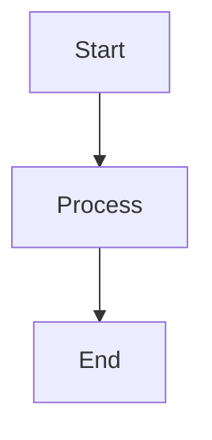

# GitHub Wiki Documentation

This directory contains comprehensive documentation for the sw-checklist project, ready for GitHub Wiki deployment.

## Contents

- **[Home.md](Home.md)** - Overview page with navigation and quick links
- **[Architecture-Overview.md](Architecture-Overview.md)** - System architecture with block diagrams
- **[System-Flows.md](System-Flows.md)** - Sequence diagrams and execution flows
- **[Component-Details.md](Component-Details.md)** - Detailed component documentation
- **[Check-Orchestration.md](Check-Orchestration.md)** - Check coordination details
- **[Modularity-Checks.md](Modularity-Checks.md)** - Modularity validation guide
- **[Clap-CLI-Checks.md](Clap-CLI-Checks.md)** - CLI validation details
- **[WASM-Checks.md](WASM-Checks.md)** - WASM validation details
- **[Design-Decisions.md](Design-Decisions.md)** - Architectural Decision Records
- **[Testing-Strategy.md](Testing-Strategy.md)** - Test organization and coverage

## Features

- 20+ Mermaid diagrams (flowcharts, sequence diagrams, graphs, gantt charts)
- Complete architecture documentation
- Cross-referenced navigation
- Code examples and implementation details
- Design rationale and trade-offs

## Deploying to GitHub Wiki

### Option 1: Manual Upload via GitHub Web Interface

1. Go to https://github.com/softwarewrighter/sw-checklist/wiki
2. Click "Create the first page" or "New Page"
3. For each .md file in this directory:
   - Create a new wiki page
   - Use the filename without .md as the page title (e.g., "Home" for Home.md)
   - Copy the markdown content
   - Paste and save

### Option 2: Git Clone and Push

GitHub wikis are git repositories that can be cloned and pushed to:

```bash
# Clone the wiki repository
git clone https://github.com/softwarewrighter/sw-checklist.wiki.git

# Copy wiki files
cp wiki/*.md sw-checklist.wiki/

# Commit and push
cd sw-checklist.wiki
git add *.md
git commit -m "Add comprehensive architecture documentation"
git push origin master
```

### Option 3: Keep in Main Repository (Current)

The wiki documentation is currently stored in the main repository under `wiki/` directory. This provides:

- Version control alongside code
- Easy updates via pull requests
- Documentation always in sync with code

To view the documentation:
- Browse the `wiki/` directory on GitHub
- GitHub will render the Mermaid diagrams automatically

## Diagram Rendering

All diagrams use Mermaid syntax, which GitHub renders natively. No external tools needed.

Example:


## Updating Documentation

To update the wiki:

1. Edit the .md files in this directory
2. Commit changes to the main repository
3. (Optional) Push to GitHub wiki repository if using Option 2

## Structure

The documentation follows a hierarchical structure:

```
Home (overview)
├── Architecture-Overview (high-level design)
│   ├── System-Flows (detailed flows)
│   └── Component-Details (implementation)
├── Check-Orchestration (check coordination)
│   ├── Modularity-Checks (modularity details)
│   ├── Clap-CLI-Checks (CLI details)
│   └── WASM-Checks (WASM details)
├── Design-Decisions (why we made these choices)
└── Testing-Strategy (how we test)
```

## Maintenance

Keep the wiki documentation synchronized with code changes:

- Update diagrams when architecture changes
- Add new pages for new features
- Update examples when APIs change
- Keep cross-references accurate
