# System Flows

This document details the execution flows through sw-checklist using sequence diagrams and flowcharts.

## Table of Contents

1. [Main Execution Flow](#main-execution-flow)
2. [Project Discovery Flow](#project-discovery-flow)
3. [Check Orchestration Flow](#check-orchestration-flow)
4. [Clap Check Flow](#clap-check-flow)
5. [Modularity Check Flow](#modularity-check-flow)
6. [Result Aggregation Flow](#result-aggregation-flow)
7. [Error Handling Flow](#error-handling-flow)

## Main Execution Flow

### Complete End-to-End Sequence

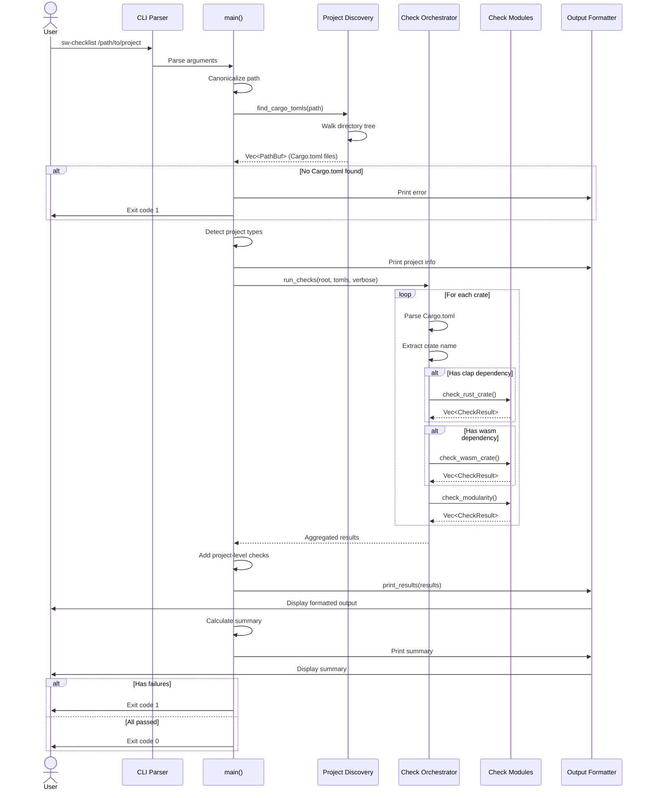

### Simplified Flow Diagram

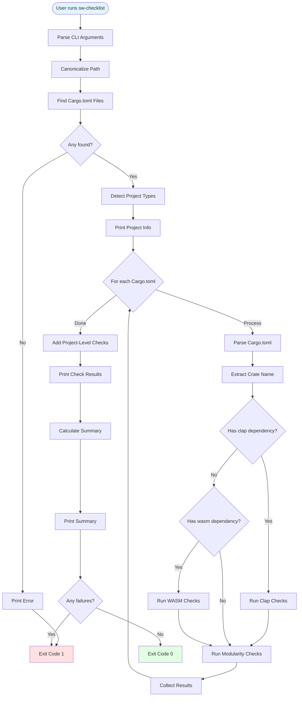

## Project Discovery Flow

### Detailed Discovery Sequence

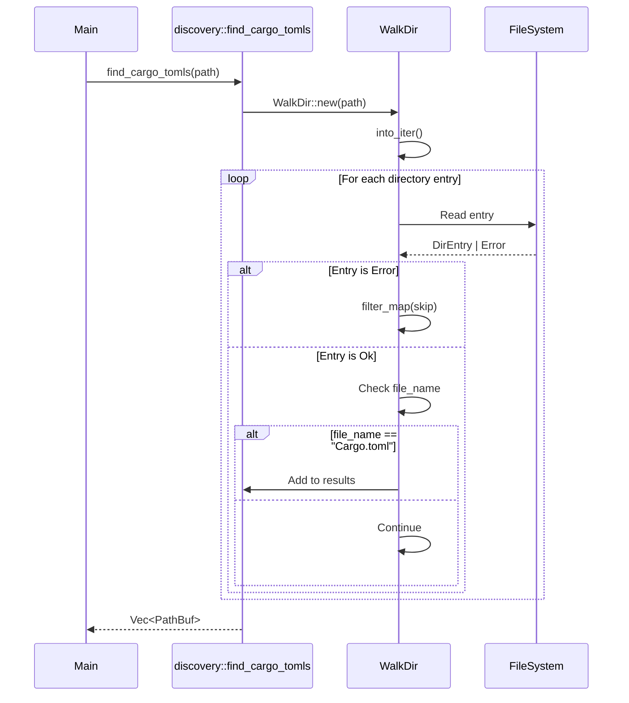

### Type Detection Flow

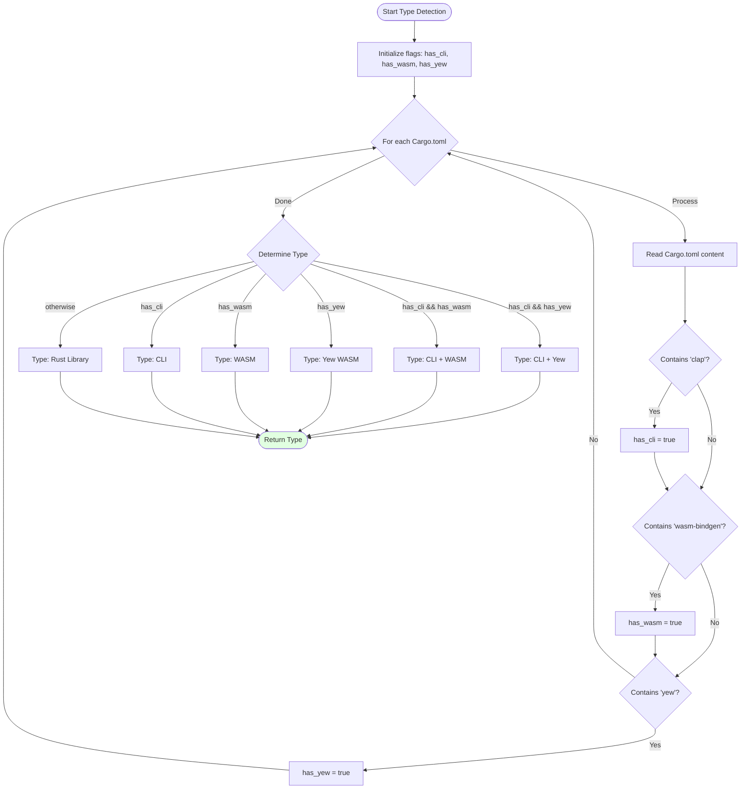

## Check Orchestration Flow

### Orchestration Sequence

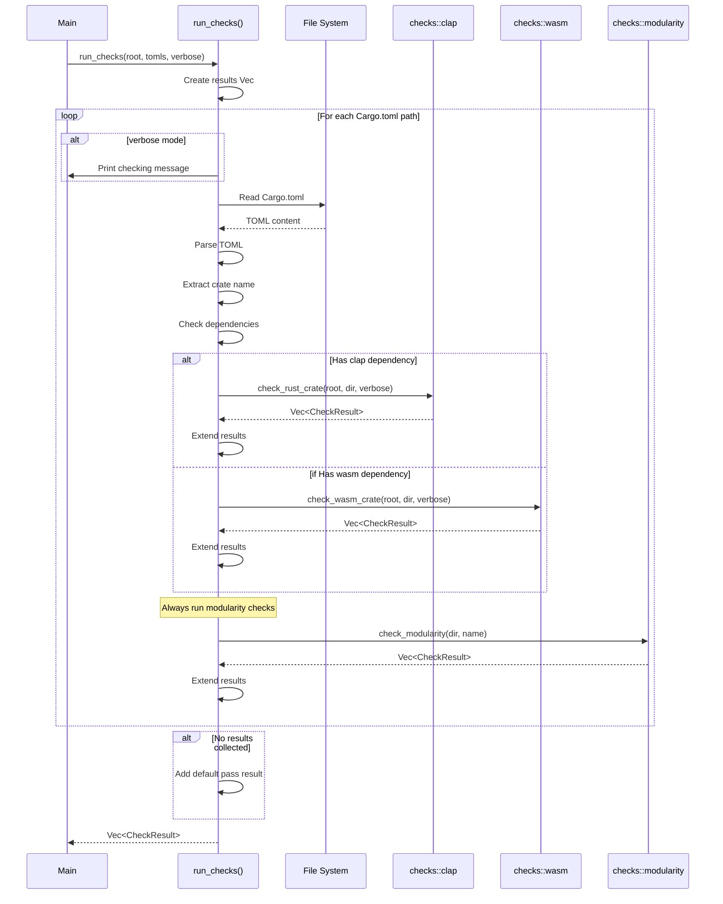

## Clap Check Flow

### Binary Discovery and Validation

```mermaid
flowchart TD
    Start([check_rust_crate]) --> CheckDep{Has clap dependency?}

    CheckDep -->|No| SkipCheck[Return: Skipped]
    CheckDep -->|Yes| AddPass[Add: Dependency Check PASS]

    AddPass --> FindBin[Find binaries in target/]
    FindBin --> ParseToml[Parse Cargo.toml]
    ParseToml --> GetBinNames[Extract binary names]

    GetBinNames --> SearchDebug[Search target/debug/]
    SearchDebug --> SearchRelease[Search target/release/]

    SearchRelease --> AnyBin{Found any binaries?}

    AnyBin -->|No| WarnNoBin[Add: No Binary WARN]
    AnyBin -->|Yes| LoopBin{For each binary}

    WarnNoBin --> Return([Return Results])

    LoopBin -->|Process| ExecHelp[Execute: binary -h]
    ExecHelp --> ExecHelpLong[Execute: binary --help]
    ExecHelpLong --> CompareHelp{--help longer than -h?}

    CompareHelp -->|Yes| PassHelp[Add: Help Length PASS]
    CompareHelp -->|No| FailHelp[Add: Help Length FAIL]

    PassHelp --> CheckAI{--help contains AI instructions?}
    FailHelp --> CheckAI

    CheckAI -->|Yes| PassAI[Add: AI Instructions PASS]
    CheckAI -->|No| FailAI[Add: AI Instructions FAIL]

    PassAI --> ExecVersion[Execute: binary -V]
    FailAI --> ExecVersion
    ExecVersion --> ExecVersionLong[Execute: binary --version]

    ExecVersionLong --> CompareVer{-V equals --version?}

    CompareVer -->|Yes| PassVer[Add: Version Consistency PASS]
    CompareVer -->|No| FailVer[Add: Version Consistency FAIL]

    PassVer --> CheckFields[Check version fields]
    FailVer --> CheckFields

    CheckFields --> CheckCopy{Contains Copyright?}
    CheckCopy -->|Yes| PassCopy[Add: Copyright PASS]
    CheckCopy -->|No| FailCopy[Add: Copyright FAIL]

    PassCopy --> CheckLic{Contains License?}
    FailCopy --> CheckLic

    CheckLic -->|Yes| PassLic[Add: License PASS]
    CheckLic -->|No| FailLic[Add: License FAIL]

    PassLic --> CheckRepo{Contains Repository?}
    FailLic --> CheckRepo

    CheckRepo -->|Yes| PassRepo[Add: Repository PASS]
    CheckRepo -->|No| FailRepo[Add: Repository FAIL]

    PassRepo --> CheckHost{Contains Build Host?}
    FailRepo --> CheckHost

    CheckHost -->|Yes| PassHost[Add: Build Host PASS]
    CheckHost -->|No| FailHost[Add: Build Host FAIL]

    PassHost --> CheckCommit{Contains Build Commit?}
    FailHost --> CheckCommit

    CheckCommit -->|Yes| PassCommit[Add: Build Commit PASS]
    CheckCommit -->|No| FailCommit[Add: Build Commit FAIL]

    PassCommit --> CheckTime{Contains Build Time?}
    FailCommit --> CheckTime

    CheckTime -->|Yes| PassTime[Add: Build Time PASS]
    CheckTime -->|No| FailTime[Add: Build Time FAIL]

    PassTime --> CheckFresh[Check binary freshness]
    FailTime --> CheckFresh

    CheckFresh --> LoopBin

    LoopBin -->|Done| Return

    style Start fill:#e1f5ff
    style Return fill:#e1ffe1
```

## Modularity Check Flow

### Function LOC Counting Algorithm

```mermaid
flowchart TD
    Start([check_modularity]) --> FindRS[Find all .rs files in src/]
    FindRS --> InitResults[Initialize results Vec]
    InitResults --> InitCounts[Initialize module_counts HashMap]

    InitCounts --> LoopFiles{For each .rs file}

    LoopFiles -->|Process| ReadFile[Read file lines]
    ReadFile --> InitFuncCount[function_count = 0]
    InitFuncCount --> LoopLines{For each line}

    LoopLines -->|Process| CheckFunc{Line starts with fn or pub fn?}

    CheckFunc -->|No| NextLine[i++]
    CheckFunc -->|Yes| ExtractName[Extract function name]

    ExtractName --> FindBrace[Find opening brace line]
    FindBrace --> CountBraces[Count braces to find end]

    CountBraces --> CalcLOC[loc = end_line - start_line + 1]
    CalcLOC --> CheckLOC{loc > 50?}

    CheckLOC -->|Yes| FailLOC[Add: Function LOC FAIL]
    CheckLOC -->|No| WarnLOC{loc > 25?}

    WarnLOC -->|Yes| WarnLOCRes[Add: Function LOC WARN]
    WarnLOC -->|No| PassLOC[Add: Function LOC PASS]

    FailLOC --> IncFunc[function_count++]
    WarnLOCRes --> IncFunc
    PassLOC --> IncFunc

    IncFunc --> JumpEnd[i = end_line + 1]
    JumpEnd --> LoopLines

    NextLine --> LoopLines

    LoopLines -->|Done| CheckModFunc{function_count > 7?}

    CheckModFunc -->|Yes| FailModFunc[Add: Module Function Count FAIL]
    CheckModFunc -->|No| WarnModFunc{function_count > 4?}

    WarnModFunc -->|Yes| WarnModFuncRes[Add: Module Function Count WARN]
    WarnModFunc -->|No| PassModFunc[Add: Module Function Count PASS]

    FailModFunc --> StoreCount[Store function_count]
    WarnModFuncRes --> StoreCount
    PassModFunc --> StoreCount

    StoreCount --> CheckFileLOC{File lines > 500?}

    CheckFileLOC -->|Yes| FailFileLOC[Add: File LOC FAIL]
    CheckFileLOC -->|No| WarnFileLOC{File lines > 350?}

    WarnFileLOC -->|Yes| WarnFileLOCRes[Add: File LOC WARN]
    WarnFileLOC -->|No| PassFileLOC[Add: File LOC PASS]

    FailFileLOC --> LoopFiles
    WarnFileLOCRes --> LoopFiles
    PassFileLOC --> LoopFiles

    LoopFiles -->|Done| CountMods[module_count = files.len()]
    CountMods --> CheckCrateMod{module_count > 7?}

    CheckCrateMod -->|Yes| FailCrateMod[Add: Crate Module Count FAIL]
    CheckCrateMod -->|No| WarnCrateMod{module_count > 4?}

    WarnCrateMod -->|Yes| WarnCrateModRes[Add: Crate Module Count WARN]
    WarnCrateMod -->|No| PassCrateMod[Add: Crate Module Count PASS]

    FailCrateMod --> Return([Return Results])
    WarnCrateModRes --> Return
    PassCrateMod --> Return

    style Start fill:#e1f5ff
    style Return fill:#e1ffe1
```

### Brace Counting Detail

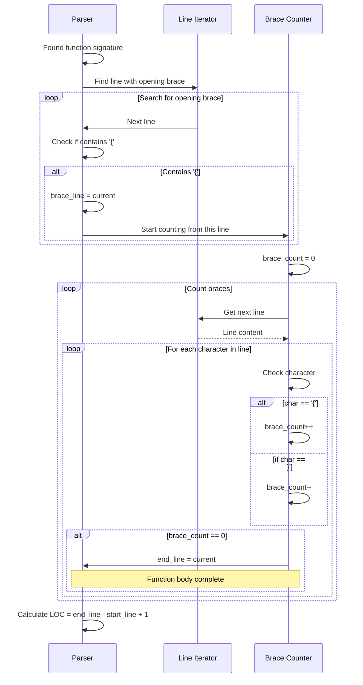

## Result Aggregation Flow

### Result Collection and Summary

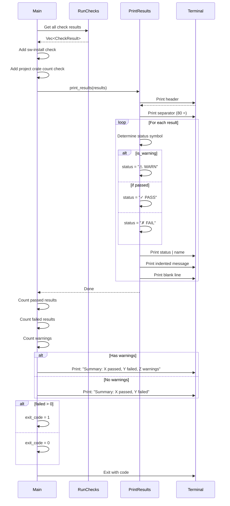

## Error Handling Flow

### Error Context Propagation

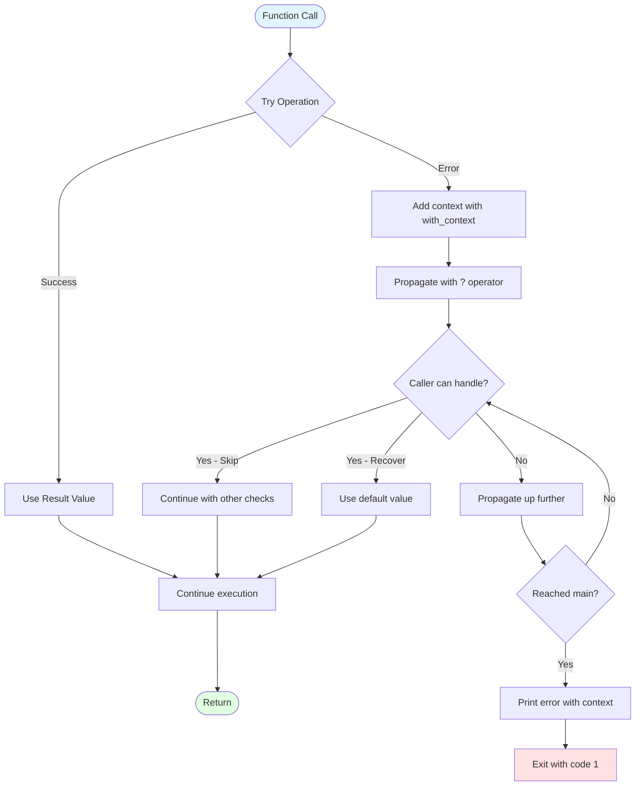

### Graceful Degradation

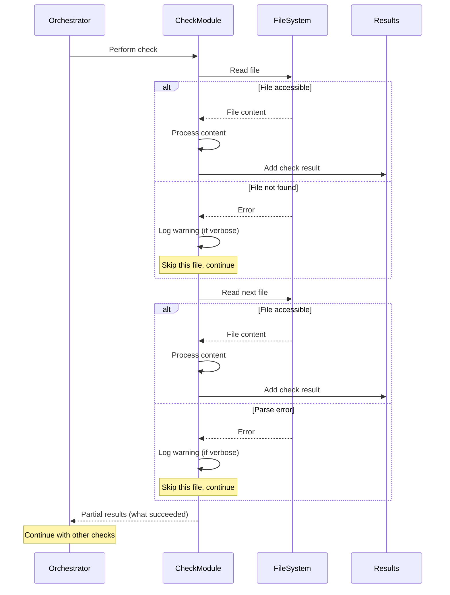

## Performance Considerations

### Parallel Opportunities (Future)

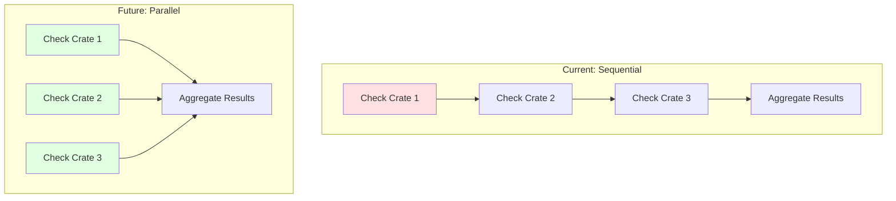

## Related Documentation

- **[Architecture Overview](Architecture-Overview)** - System architecture and components
- **[Component Details](Component-Details)** - Detailed component documentation
- **[Check Orchestration](Check-Orchestration)** - Check coordination details
- **[Modularity Checks](Modularity-Checks)** - Modularity validation details
