# Testing Strategy

Comprehensive testing approach for sw-checklist.

## Overview

sw-checklist uses a Test-Driven Development (TDD) approach with comprehensive unit and integration tests. All tests are embedded in source files and use isolated temporary fixtures.

## Testing Philosophy

### 1. Test-Driven Development (TDD)

**Process**:

```mermaid
graph LR
    Red[🔴 RED<br/>Write Failing Test] --> Green[🟢 GREEN<br/>Make It Pass]
    Green --> Refactor[🔵 REFACTOR<br/>Clean Up Code]
    Refactor --> Red

    style Red fill:#ffe1e1
    style Green fill:#e1ffe1
    style Refactor fill:#e1f5ff
```


**Example: Modularity Checks**

**RED**: Write failing test
```rust
#[test]
fn test_function_loc_over_50_fail() {
    let temp = tempdir().unwrap();
    let crate_dir = temp.path().join("test-crate");

    // Create function with 60 lines
    // ...

    let results = check_modularity(&crate_dir, "test-crate").unwrap();

    // This will fail initially
    assert!(results.iter().any(|r| !r.passed));
}
```

**GREEN**: Implement minimum to pass
```rust
pub fn check_modularity(crate_dir: &Path, crate_name: &str)
    -> Result<Vec<CheckResult>>
{
    // Basic implementation to pass test
    let mut results = Vec::new();

    // Find .rs files, count LOC, check thresholds
    // ...

    Ok(results)
}
```

**REFACTOR**: Clean up while keeping tests green
```rust
// Extract helper functions
fn count_function_loc(file: &Path) -> Result<Vec<CheckResult>> { }
fn extract_function_name(line: &str) -> String { }
// Etc.
```

### 2. Isolation with Temporary Fixtures

**Pattern**: Use `tempfile::tempdir()` for isolated test environments

```rust
use tempfile::tempdir;

#[test]
fn test_something() {
    // Create isolated directory
    let temp = tempdir().unwrap();
    let crate_dir = temp.path().join("test-crate");
    fs::create_dir_all(&crate_dir).unwrap();

    // Create test files
    fs::write(
        crate_dir.join("Cargo.toml"),
        "[package]\nname = \"test-crate\"\n"
    ).unwrap();

    // Run test
    let results = check_something(&crate_dir).unwrap();

    // Assert expectations
    assert!(results.iter().any(|r| r.passed));

    // temp automatically cleaned up when dropped
}
```

**Benefits**:
- No test pollution
- Parallel test execution safe
- Automatic cleanup
- Easy to reason about

### 3. Comprehensive Coverage

**Goal**: Test all code paths


## Test Organization

### File Structure

```rust
// src/main.rs
fn main() { /* ... */ }

fn some_function() { /* ... */ }

// Tests at end of file
#[cfg(test)]
mod tests {
    use super::*;

    #[test]
    fn test_some_function() {
        // Test implementation
    }
}
```

### Test Categories

#### 1. Unit Tests

**Purpose**: Test individual functions in isolation

**Location**: Same file as implementation

**Example**:
```rust
// In src/checks/mod.rs
impl CheckResult {
    pub fn pass(name: impl Into<String>, message: impl Into<String>) -> Self {
        Self {
            name: name.into(),
            passed: true,
            message: message.into(),
            is_warning: false,
        }
    }
}

#[cfg(test)]
mod tests {
    use super::*;

    #[test]
    fn test_check_result_pass() {
        let result = CheckResult::pass("Test", "Message");
        assert!(result.passed);
        assert!(!result.is_warning);
        assert_eq!(result.name, "Test");
        assert_eq!(result.message, "Message");
    }
}
```

#### 2. Integration Tests

**Purpose**: Test complete workflows end-to-end

**Location**: `src/main.rs` tests module

**Example**:
```rust
#[test]
fn test_workspace_structure() {
    use tempfile::tempdir;

    let temp = tempdir().unwrap();

    // Create workspace with multiple crates
    let workspace_toml = temp.path().join("Cargo.toml");
    fs::write(&workspace_toml, r#"
[workspace]
members = ["crate1", "crate2"]
"#).unwrap();

    // Create member crates
    fs::create_dir_all(temp.path().join("crate1")).unwrap();
    fs::write(
        temp.path().join("crate1/Cargo.toml"),
        "[package]\nname = \"crate1\"\n"
    ).unwrap();

    // More setup...

    // Test discovery
    let found = discovery::find_cargo_tomls(temp.path());
    assert_eq!(found.len(), 3); // workspace + 2 members

    // Test checks
    let results = run_checks(temp.path(), &found, false).unwrap();
    assert!(!results.is_empty());
}
```

#### 3. Edge Case Tests

**Purpose**: Test boundary conditions and unusual inputs

**Examples**:
```rust
#[test]
fn test_empty_file() {
    let temp = tempdir().unwrap();
    let crate_dir = temp.path().join("test-crate");
    fs::create_dir_all(crate_dir.join("src")).unwrap();

    // Empty file
    fs::write(crate_dir.join("src/lib.rs"), "").unwrap();

    let results = check_modularity(&crate_dir, "test-crate").unwrap();

    // Should pass (no violations in empty file)
    assert!(results.iter().all(|r| r.passed));
}

#[test]
fn test_function_exactly_at_threshold() {
    // Test function with exactly 25 lines
    // Should PASS (not warn)

    // Test function with exactly 26 lines
    // Should WARN (not fail)

    // Test function with exactly 50 lines
    // Should WARN (not fail)

    // Test function with exactly 51 lines
    // Should FAIL
}
```

## Test Coverage by Feature

### Modularity Checks

**Function LOC Tests** (3):
```rust
#[test]
fn test_function_loc_under_25_pass() { /* ✓ PASS */ }

#[test]
fn test_function_loc_26_to_50_warn() { /* ⚠ WARN */ }

#[test]
fn test_function_loc_over_50_fail() { /* ✗ FAIL */ }
```

**Module Function Count Tests** (3):
```rust
#[test]
fn test_module_function_count_under_4_pass() { /* ✓ PASS */ }

#[test]
fn test_module_function_count_5_to_7_warn() { /* ⚠ WARN */ }

#[test]
fn test_module_function_count_over_7_fail() { /* ✗ FAIL */ }
```

**File LOC Tests** (3):
```rust
#[test]
fn test_file_loc_under_350_pass() { /* ✓ PASS */ }

#[test]
fn test_file_loc_351_to_500_warn() { /* ⚠ WARN */ }

#[test]
fn test_file_loc_over_500_fail() { /* ✗ FAIL */ }
```

**Crate Module Count Tests** (2):
```rust
#[test]
fn test_crate_module_count_under_4_pass() { /* ✓ PASS */ }

#[test]
fn test_crate_module_count_over_7_fail() { /* ✗ FAIL */ }
```

### Discovery Tests

**Project Discovery Tests** (4):
```rust
#[test]
fn test_find_cargo_tomls() { /* Single crate */ }

#[test]
fn test_find_no_cargo_tomls() { /* Empty directory */ }

#[test]
fn test_workspace_structure() { /* Workspace */ }

#[test]
fn test_nested_crates() { /* Deep nesting */ }
```

### Installation Tests

**Binary Freshness Tests** (3):
```rust
#[test]
fn test_check_binary_freshness_no_installed_binary() { }

#[test]
fn test_check_binary_freshness_local_newer() { }

#[test]
fn test_check_binary_freshness_installed_newer() { }
```

**sw-install Presence Test** (1):
```rust
#[test]
fn test_check_sw_install_present() { }
```

### Core Tests

**CheckResult Tests** (2):
```rust
#[test]
fn test_check_result_creation() { }

#[test]
fn test_check_result_warn() { }
```

## Test Execution

### Running Tests

```bash
# Run all tests
cargo test

# Run tests with output
cargo test -- --nocapture

# Run specific test
cargo test test_function_loc_under_25_pass

# Run tests matching pattern
cargo test modularity

# Run with verbose output
cargo test -- --nocapture --test-threads=1
```

### Test Output

**Success**:
```
running 26 tests
test tests::test_check_result_creation ... ok
test tests::test_check_result_warn ... ok
test tests::test_find_cargo_tomls ... ok
test tests::test_function_loc_under_25_pass ... ok
...

test result: ok. 26 passed; 0 failed; 0 ignored; 0 measured; 0 filtered out
```

**Failure**:
```
running 26 tests
test tests::test_function_loc_over_50_fail ... FAILED

failures:

---- tests::test_function_loc_over_50_fail stdout ----
thread 'tests::test_function_loc_over_50_fail' panicked at 'assertion failed:
results.iter().any(|r| !r.passed)', src/main.rs:686:9

failures:
    tests::test_function_loc_over_50_fail

test result: FAILED. 25 passed; 1 failed; 0 ignored; 0 measured; 0 filtered out
```

## Test Data Patterns

### Minimal Test Case

**Strategy**: Create smallest possible test case

```rust
#[test]
fn test_small_function_pass() {
    let temp = tempdir().unwrap();
    let crate_dir = temp.path().join("test-crate");
    fs::create_dir_all(crate_dir.join("src")).unwrap();

    // Minimal Cargo.toml
    fs::write(
        crate_dir.join("Cargo.toml"),
        "[package]\nname = \"test-crate\"\n"
    ).unwrap();

    // Minimal source file
    fs::write(
        crate_dir.join("src/lib.rs"),
        "pub fn small() { }\n"
    ).unwrap();

    let results = check_modularity(&crate_dir, "test-crate").unwrap();

    // Should pass
    assert!(results.iter().all(|r| r.passed));
}
```

### Generated Test Data

**Strategy**: Generate large test cases programmatically

```rust
#[test]
fn test_large_function_fail() {
    let temp = tempdir().unwrap();
    let crate_dir = temp.path().join("test-crate");
    fs::create_dir_all(crate_dir.join("src")).unwrap();

    // Generate function with 60 lines
    let mut content = String::from("pub fn huge_function() {\n");
    for i in 0..58 {
        content.push_str(&format!("    let x{} = {};\n", i, i));
    }
    content.push_str("}\n");

    fs::write(crate_dir.join("src/lib.rs"), content).unwrap();

    let results = check_modularity(&crate_dir, "test-crate").unwrap();

    // Should fail
    assert!(results.iter().any(|r| !r.passed));
}
```

### Realistic Test Cases

**Strategy**: Test real-world scenarios

```rust
#[test]
fn test_crate_without_clap() {
    let temp = tempdir().unwrap();
    let cargo_toml = temp.path().join("Cargo.toml");

    // Realistic Cargo.toml without clap
    fs::write(&cargo_toml, r#"
[package]
name = "my-library"
version = "0.1.0"

[dependencies]
serde = "1.0"
tokio = "1.0"
"#).unwrap();

    let found = discovery::find_cargo_tomls(temp.path());
    assert_eq!(found.len(), 1);

    let results = run_checks(temp.path(), &found, false).unwrap();

    // Should skip clap/WASM checks, run modularity
    assert!(!results.is_empty());
    assert!(results.iter().all(|r| r.passed || r.is_warning));
}
```

## Test Assertions

### Common Assertion Patterns

**Count Checks**:
```rust
// Exact count
assert_eq!(results.len(), 5);

// Minimum count
assert!(results.len() >= 3);

// Count specific results
let passed = results.iter().filter(|r| r.passed).count();
assert_eq!(passed, 10);
```

**Content Checks**:
```rust
// Any matching
assert!(results.iter().any(|r| r.name.contains("Function LOC")));

// All matching
assert!(results.iter().all(|r| r.passed));

// None matching
assert!(!results.iter().any(|r| !r.passed));
```

**Message Checks**:
```rust
// Contains specific text
let result = &results[0];
assert!(result.message.contains("max 50"));

// Exact message
assert_eq!(result.message, "Found clap dependency");
```

### Custom Assertions

```rust
// Helper for common patterns
fn assert_has_failure(results: &[CheckResult], name_pattern: &str) {
    assert!(
        results.iter().any(|r| !r.passed && r.name.contains(name_pattern)),
        "Expected failure matching '{}', got: {:?}",
        name_pattern,
        results
    );
}

// Usage
#[test]
fn test_something() {
    let results = check_modularity(...).unwrap();
    assert_has_failure(&results, "Function LOC");
}
```

## Continuous Integration

### GitHub Actions Workflow

```yaml
# .github/workflows/test.yml
name: Tests

on: [push, pull_request]

jobs:
  test:
    runs-on: ubuntu-latest

    steps:
    - uses: actions/checkout@v3

    - name: Install Rust
      uses: actions-rs/toolchain@v1
      with:
        toolchain: stable
        override: true

    - name: Run tests
      run: cargo test --verbose

    - name: Run clippy
      run: cargo clippy -- -D warnings

    - name: Check formatting
      run: cargo fmt -- --check

    - name: Run sw-checklist on itself
      run: |
        cargo build --release
        ./target/release/sw-checklist .
```

### Pre-commit Hook

```bash
#!/bin/bash
# .git/hooks/pre-commit

echo "Running tests..."
cargo test --quiet

if [ $? -ne 0 ]; then
    echo "Tests failed. Commit aborted."
    exit 1
fi

echo "Running sw-checklist..."
cargo build --release --quiet
./target/release/sw-checklist .

if [ $? -ne 0 ]; then
    echo "sw-checklist failed. Commit aborted."
    exit 1
fi

echo "All checks passed!"
```

## Test Statistics

### Current Coverage

| Category | Tests | Passing |
|----------|-------|---------|
| CheckResult | 2 | 2 |
| Discovery | 4 | 4 |
| Modularity | 11 | 11 |
| Installation | 4 | 4 |
| Integration | 5 | 5 |
| **Total** | **26** | **26** |

### Coverage by Feature


## Future Testing Enhancements

### 1. Property-Based Testing

```rust
// Using proptest (future)
use proptest::prelude::*;

proptest! {
    #[test]
    fn test_any_function_under_50_lines_passes(
        lines in 1usize..50
    ) {
        // Generate function with `lines` lines
        // Assert it passes
    }
}
```

### 2. Benchmark Tests

```rust
// Using criterion (future)
use criterion::{black_box, criterion_group, criterion_main, Criterion};

fn bench_modularity_check(c: &mut Criterion) {
    c.bench_function("check_modularity_large_file", |b| {
        b.iter(|| {
            check_modularity(black_box(&large_file_path), "bench")
        });
    });
}

criterion_group!(benches, bench_modularity_check);
criterion_main!(benches);
```

### 3. Snapshot Testing

```rust
// Using insta (future)
use insta::assert_debug_snapshot;

#[test]
fn test_check_output_format() {
    let results = run_checks(...).unwrap();
    assert_debug_snapshot!(results);
}
```

## Related Documentation

- **[Architecture Overview](Architecture-Overview)** - System design
- **[Design Decisions](Design-Decisions)** - Why these choices?
- **[Component Details](Component-Details)** - Implementation details
