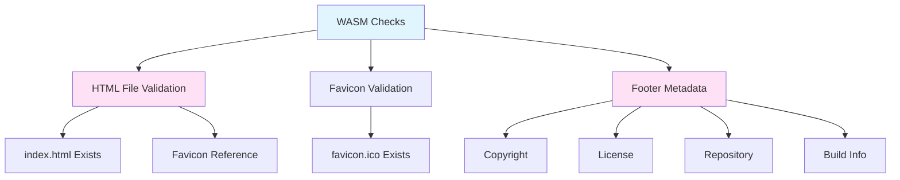
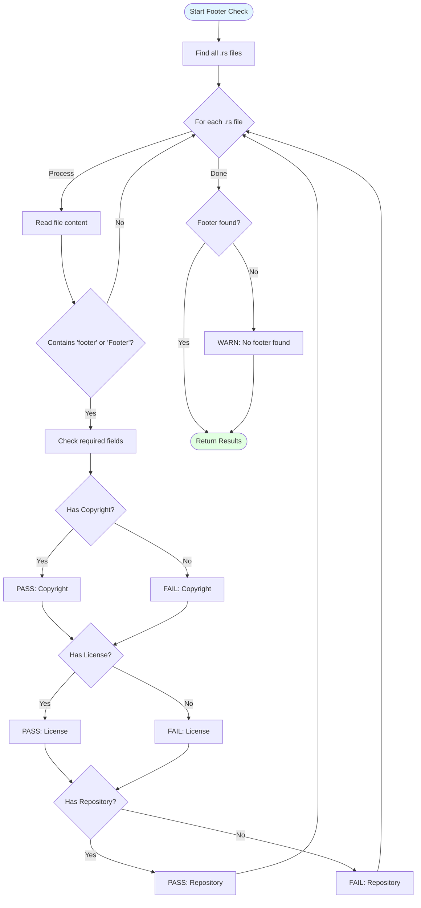
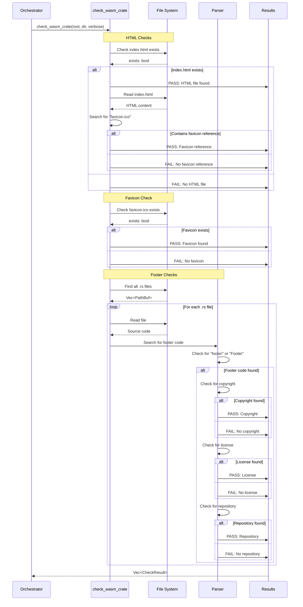

# WASM Checks

Validation checks for WebAssembly projects including Yew applications.

## Overview

WASM checks ensure that WebAssembly projects have proper HTML scaffolding, resources, and metadata. These checks are particularly important for frontend applications built with Yew or other WASM frameworks.

## Check Categories



## 1. HTML File Validation

### 1.1 Index.html Existence

**Purpose**: Verify main HTML file exists

**Check Location**: `{crate_dir}/index.html`

**Check Logic**:
```rust
let index_html = crate_dir.join("index.html");

if index_html.exists() {
    CheckResult::pass(
        format!("HTML File [{}]", crate_name),
        "Found index.html"
    )
} else {
    CheckResult::fail(
        format!("HTML File [{}]", crate_name),
        "Missing index.html - WASM projects need an HTML entry point"
    )
}
```

**Why It Matters**: WASM applications need an HTML file to:
- Load the WASM binary
- Provide initial page structure
- Configure the JavaScript runtime

### 1.2 Favicon Reference

**Purpose**: Ensure HTML references favicon

**Check Logic**:
```rust
let index_html = crate_dir.join("index.html");
let html_content = fs::read_to_string(&index_html)?;

if html_content.contains("favicon.ico") {
    CheckResult::pass(
        format!("Favicon Reference [{}]", crate_name),
        "index.html references favicon.ico"
    )
} else {
    CheckResult::fail(
        format!("Favicon Reference [{}]", crate_name),
        "index.html should reference favicon.ico in <head> section"
    )
}
```

**Expected HTML**:
```html
<!DOCTYPE html>
<html>
<head>
    <meta charset="utf-8"/>
    <title>My WASM App</title>
    <link rel="icon" type="image/x-icon" href="favicon.ico">
</head>
<body>
    <script type="module">
        import init from './pkg/my_wasm_app.js';
        init();
    </script>
</body>
</html>
```

## 2. Favicon Validation

**Purpose**: Verify favicon file exists

**Check Location**: `{crate_dir}/favicon.ico`

**Check Logic**:
```rust
let favicon = crate_dir.join("favicon.ico");

if favicon.exists() {
    CheckResult::pass(
        format!("Favicon [{}]", crate_name),
        "Found favicon.ico"
    )
} else {
    CheckResult::fail(
        format!("Favicon [{}]", crate_name),
        "Missing favicon.ico - browsers will request this file"
    )
}
```

**Why It Matters**:
- Browsers automatically request `/favicon.ico`
- Missing favicon causes 404 errors
- Professional appearance
- Browser tab identification

**Favicon Best Practices**:
```
favicon.ico should be:
- 16x16 or 32x32 pixels (multi-size .ico recommended)
- Placed in project root
- Referenced in HTML <head>
```

## 3. Footer Metadata

**Purpose**: Validate application footer contains required metadata

### 3.1 Footer Search Strategy



### 3.2 Footer Field Validation

#### Copyright Field

**Patterns Searched**:
- `"copyright"`
- `"©"`
- `"copyright (c)"`

**Example Yew Code**:
```rust
use yew::prelude::*;

#[function_component(Footer)]
pub fn footer() -> Html {
    html! {
        <footer>
            <p>{ "© 2025 Your Name" }</p>
            <p>{ "MIT License" }</p>
            <p>
                <a href="https://github.com/user/project">
                    { "GitHub Repository" }
                </a>
            </p>
        </footer>
    }
}
```

#### License Field

**Patterns Searched**:
- `"license"`
- `"mit"`
- `"apache"`
- `"gpl"`

**Example**:
```rust
html! {
    <footer>
        <div class="license">
            { "Licensed under MIT License" }
        </div>
    </footer>
}
```

#### Repository Field

**Patterns Searched**:
- `"repository"`
- `"github"`
- `"repo"`
- `"source"`

**Example**:
```rust
const REPO_URL: &str = "https://github.com/user/project";

html! {
    <footer>
        <a href={REPO_URL}>{ "View Source" }</a>
    </footer>
}
```

#### Build Information (Optional)

**Patterns Searched**:
- `"build"`
- `"version"`
- `"commit"`

**Example**:
```rust
const VERSION: &str = env!("CARGO_PKG_VERSION");
const BUILD_COMMIT: &str = env!("BUILD_COMMIT_SHA");

html! {
    <footer>
        <p>
            { format!("Version {} ({})",
                     VERSION,
                     &BUILD_COMMIT[..8]) }
        </p>
    </footer>
}
```

## Complete Check Flow



## Example Yew Footer Implementation

### Complete Footer Component

```rust
use yew::prelude::*;

const VERSION: &str = env!("CARGO_PKG_VERSION");
const REPO: &str = env!("CARGO_PKG_REPOSITORY");
const BUILD_COMMIT: &str = env!("BUILD_COMMIT_SHA");
const BUILD_TIME: &str = env!("BUILD_TIMESTAMP");

#[function_component(Footer)]
pub fn footer() -> Html {
    html! {
        <footer class="app-footer">
            <div class="footer-content">
                <div class="footer-section">
                    <p class="copyright">
                        { "© 2025 Your Name" }
                    </p>
                    <p class="license">
                        { "MIT License" }
                    </p>
                </div>

                <div class="footer-section">
                    <p class="version">
                        { format!("Version: {}", VERSION) }
                    </p>
                    <p class="build-info">
                        { format!("Build: {} ({})",
                                 &BUILD_COMMIT[..8],
                                 BUILD_TIME) }
                    </p>
                </div>

                <div class="footer-section">
                    <a href={REPO} class="repo-link"
                       target="_blank" rel="noopener noreferrer">
                        { "View on GitHub" }
                    </a>
                </div>
            </div>
        </footer>
    }
}
```

### Using Footer in App

```rust
#[function_component(App)]
pub fn app() -> Html {
    html! {
        <div class="app">
            <header>
                <h1>{ "My WASM App" }</h1>
            </header>

            <main>
                // App content
            </main>

            <Footer />
        </div>
    }
}
```

## Project Structure

### Recommended WASM Project Layout

```
my-wasm-app/
├── Cargo.toml
├── index.html              # Entry point HTML
├── favicon.ico             # Favicon file
├── src/
│   ├── lib.rs             # WASM entry point
│   ├── app.rs             # Main app component
│   ├── footer.rs          # Footer component
│   └── components/
│       └── ...
├── static/                # Static assets
│   ├── styles.css
│   └── images/
└── pkg/                   # Built WASM (generated)
    ├── my_wasm_app.js
    ├── my_wasm_app_bg.wasm
    └── ...
```

### Example index.html

```html
<!DOCTYPE html>
<html lang="en">
<head>
    <meta charset="utf-8"/>
    <meta name="viewport" content="width=device-width, initial-scale=1"/>
    <title>My WASM App</title>
    <link rel="icon" type="image/x-icon" href="favicon.ico">
    <link rel="stylesheet" href="static/styles.css">
</head>
<body>
    <div id="app"></div>

    <script type="module">
        import init from './pkg/my_wasm_app.js';
        await init();
    </script>

    <noscript>
        This application requires JavaScript to be enabled.
    </noscript>
</body>
</html>
```

### Example Cargo.toml

```toml
[package]
name = "my-wasm-app"
version = "0.1.0"
edition = "2021"

[lib]
crate-type = ["cdylib", "rlib"]

[dependencies]
yew = { version = "0.21", features = ["csr"] }
wasm-bindgen = "0.2"
web-sys = "0.3"

[build-dependencies]
chrono = "0.4"
hostname = "0.4"
```

## Common Issues and Solutions

### Issue: Missing index.html

**Problem**:
```
✗ FAIL | HTML File [my-wasm-app]
       Missing index.html - WASM projects need an HTML entry point
```

**Solution**: Create `index.html` in crate root:
```html
<!DOCTYPE html>
<html>
<head>
    <meta charset="utf-8"/>
    <title>My App</title>
    <link rel="icon" href="favicon.ico">
</head>
<body>
    <script type="module">
        import init from './pkg/my_wasm_app.js';
        init();
    </script>
</body>
</html>
```

### Issue: Favicon Not Referenced

**Problem**:
```
✗ FAIL | Favicon Reference [my-wasm-app]
       index.html should reference favicon.ico in <head> section
```

**Solution**: Add to `<head>`:
```html
<link rel="icon" type="image/x-icon" href="favicon.ico">
```

### Issue: Missing Favicon File

**Problem**:
```
✗ FAIL | Favicon [my-wasm-app]
       Missing favicon.ico - browsers will request this file
```

**Solution**:
1. Create or download a favicon
2. Save as `favicon.ico` in crate root
3. Or use online favicon generator

### Issue: No Footer Metadata

**Problem**:
```
✗ FAIL | Footer Copyright [my-wasm-app]
       Footer should contain copyright information
```

**Solution**: Create footer component:
```rust
#[function_component(Footer)]
pub fn footer() -> Html {
    html! {
        <footer>
            <p>{ "© 2025 Your Name" }</p>
            <p>{ "MIT License" }</p>
            <p><a href="https://github.com/user/project">
                { "Source Code" }
            </a></p>
        </footer>
    }
}
```

## Testing WASM Projects

### Manual Testing

```bash
# Install trunk (WASM build tool)
cargo install trunk

# Build and serve
trunk serve

# Open browser to http://localhost:8080
# Check:
# - Page loads
# - Favicon appears in tab
# - Footer displays correctly
# - No console errors
```

### Automated Testing

```bash
# Run sw-checklist
sw-checklist path/to/wasm-project

# Expected output:
# ✓ PASS | HTML File [my-wasm-app]
# ✓ PASS | Favicon Reference [my-wasm-app]
# ✓ PASS | Favicon [my-wasm-app]
# ✓ PASS | Footer Copyright [my-wasm-app]
# ✓ PASS | Footer License [my-wasm-app]
# ✓ PASS | Footer Repository [my-wasm-app]
```

## Build-Time Metadata for WASM

### build.rs for WASM Projects

```rust
use std::process::Command;

fn main() {
    // Git commit
    if let Ok(output) = Command::new("git")
        .args(["rev-parse", "HEAD"])
        .output()
    {
        println!(
            "cargo:rustc-env=BUILD_COMMIT_SHA={}",
            String::from_utf8_lossy(&output.stdout).trim()
        );
    } else {
        println!("cargo:rustc-env=BUILD_COMMIT_SHA=unknown");
    }

    // Timestamp
    let timestamp = chrono::Utc::now().to_rfc3339();
    println!("cargo:rustc-env=BUILD_TIMESTAMP={}", timestamp);

    // Tell Cargo to re-run if HEAD changes
    println!("cargo:rerun-if-changed=.git/HEAD");
}
```

## Performance Considerations

### Check Performance

- **HTML file check**: <1ms (single file read)
- **Favicon check**: <1ms (file existence check)
- **Footer scan**: 10-50ms (depends on file count)

### Optimization Tips

For projects with many source files:
- Footer checks only scan .rs files
- Checks stop after finding first footer
- Can skip with configuration (future feature)

## Related Documentation

- **[Architecture Overview](Architecture-Overview)** - System design
- **[Check Orchestration](Check-Orchestration)** - How checks run
- **[Component Details](Component-Details)** - Implementation details
- **[Clap CLI Checks](Clap-CLI-Checks)** - CLI validation
